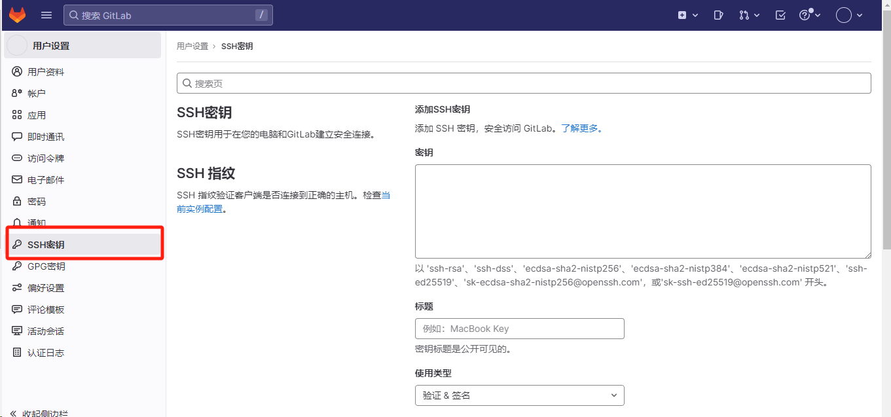

# Git登录

Git登录就是连接到远程的仓库

## 下载Git客户端

可以在https://git-scm.com/上下载Git bash后面就可以在这个命令行拉取代码之类的

## 服务端注册账号

在Git服务端（例如Github或者是Gitee）上注册账号

## 创建公钥和私钥

```bash
# 使用两种不同的加密算法生成公钥和密钥
ssh-keygen -t rsa -C "个人邮箱"
ssh-keygen -t ed25519 -C "个人邮箱"
```

执行完上面的命令行之后会生成四个文件，其中显示PUB文件的是公钥，选择其中一个加到SSH里面即可

<mark>注意！！！不要将私钥加入到SSH中</mark>


## 添加公钥到仓库的SSH中

点击右上角的头像部分并进入偏好设置


然后在偏好设置中的SSH中添加刚刚生成好的PUB文件内容



## 创建工作目录

创建一个目录作为你的工作目录，并在工作目录中打开git bash或者直接在git bash中进入工作目录

进入工作目录之后就可以拉取代码

## 拉取代码

复制SSH克隆或者HTTP克隆这两个命令中的一个即可

```bash
# 使用下面两个命令进行复制（推荐使用ssh）
git clone ssh://xxxxxxxx
或者是
git clone http://xxxxxxx
```

使用SSH复制的时候会出现

```bash
Are you sure you want to continue connecting (yes/no/[fingerprint])?
```

此时需要输入yes，输入yes后会在上面公钥私钥所在的文件夹中生成一个know_hosts的文件，后面就不会再出现Are you sure you want to continue connecting (yes/no/[fingerprint])?了。

每当有一个新的主机需要连接仓库的时候就要生成主机的公钥和私钥，并将公钥添加到仓库的SSH列表中，然后就可以正常的访问仓库。


# 本地项目关联远程仓库

## 本地目录初始化

```bash
cd D:\Go+Consul           # 切到你的项目根目录
git init                  # 建立一个新的本地仓库
```

## 添加文件并做首次提交

```bash
git add .                 # 将所有文件纳入版本管理
git commit -m "Initial commit: add existing project files"
```

## 关联远端仓库

```bash
git remote add origin ssh://xxxx
```

## 拉取远程分支并重放本地提交

> 由于远程 main 已经有初始提交（自动生成的 README），直接推送会冲突。使用下面的命令来解决

```bash
git pull origin main --rebase
```

> 这条命令会先把远程的提交拉下来(将远程的origin的main分支拉下来)，
>
> 然后把你本地的 `Initial commit` 暂存，
>
> 再把远程的提交合并到本地，
>
> 最后“重放”你的提交，保持历史清晰。

## 发现冲突解决并重放

```bash
# 编辑被标记了 <<<<<<< 等标记的冲突文件，删掉多余部分，保留正确内容
git add <冲突文件>
git rebase --continue
```

重复以上步骤，直到 `rebase` 完成

## 将本地历史推送到远程

```bash
git push -u origin main  // -u 会把本地 main 分支和远程 origin/main 关联，后续只需 git push
```

# 删除本地多余的文件

**删除文件**
 在项目根目录下执行：

```bash
rm main.go
```

**告诉 Git 跟踪删除**

```bash
git rm main.go
```

**提交删除操作**

```bash
git commit -m "chore: 删除根目录多余的 main.go"
```

**推送到远程**

```bash
git push
```

# 删除误上传的文件

删除误上传的文件，例如./idea文件

**加入.gitignore**

加入.gitignore，防止后续继续被上传上去

```bash
echo ".idea/" >> .gitignore
```

**从索引中删除**

为什么从索引删除就可以删除后面对应的文件呢

> 主要是Git有三个区域
>
> 1. 工作区（本地真实的文件夹）
> 2. 索引/暂存区（本次提交但是还没有推送到远端的文件）
> 3. HEAD（上一次提交的记录）
>
> 将.idea从索引中移除，那么下次就不会再提交这个文件，并且是不会动到工作区的真实文件的。为了防止日后误加回去，要把它写进 .gitignore

```bash
git rm -r --cached .idea
```

**提交并推送**

```bash
git commit -m "chore: stop tracking .idea"
git push
```

# 开发

开发一般是在自己的分支上进行开发，就是创建一个自己的分支，等到开发完成之后再合并到master分支上，前期就将代码推送到自己的分支就好，不要推送到master分支上

1. 将本地分支和远端分支做个绑定

```bash
// 拉取代码
git clone <repo-url>
cd <repo-name>

// 创建新的分支
git fetch origin  			    // 从远端拉取最新的分支信息（可能别人在这段时间内又推送新的代码上去）
git switch -c hsx origin/master  // 从远端master的快照创建并切到 hsx

// 开发与提交
git status 				// 查看文件变更的情况
git add file 		     // 将变更的文件存入暂存区
git commit -m "message"   // 生成本地提交
git push -u origin hsx  // 第一次把一个新建的本地分支推到远端时需要-u，这样后面就会将本地的hsx分支和远端的hsx分支建立联系，后面本地的hsx分支提交的代码就会到远端的hsx分支上而不是master分支上
```

2. 将远端的hsx分支合并到master分支上

在github的hsx分支上点击


> 点 **Open pull request**。
>
> 在 PR 页面确认方向是 **base: master ← compare: hsx**。
>
> 填标题/描述，点 **Create pull request**。
>
> 检查 **Files changed**，等待检查（CI）通过，需要的话找人 Review，有冲突的话就要解决冲突。
>
> 点 **Merge pull request**（默认 *Create a merge commit*；也可选 *Squash* 或 *Rebase*）。

3. 将本地的master分支更新

> 如果本地的master不会动的话，就不需要更新本地的master。本地的master分支不会写代码，只会当成远端的 origin/master 的镜像。当从最新主干再开分支的时候，可以先切master再开分支（也可以用方法二）。
> git switch master && git pull --ff-only && git switch -c new
>
> 
>
> 方法二：也可以直接从远端的origin/master新建并切换分支
>
> git fetch origin                              # 确保拿到远端最新主干
> git switch -c feature-x origin/master     # 直接从 origin/master 新建并切到本地分支
>
> git push -u origin feature-x               # 在远端创建同名分支并建立追踪关系

```bash
git switch master
git pull --ff-only   # 只同步但是不会产生提交
```