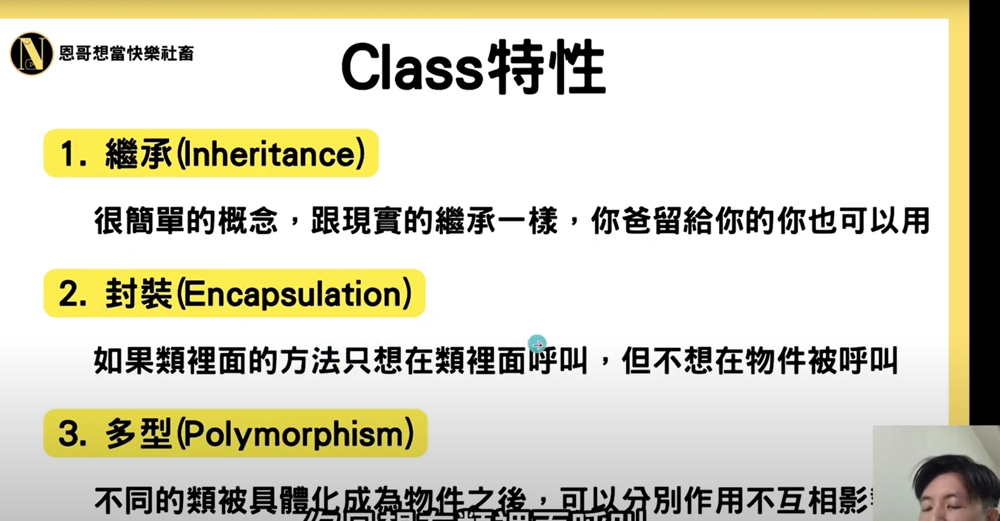

# Python

## class

类的特性什么的，可以看https://www.youtube.com/watch?v=WBrX9n0SWG8



**继承**

> 继承的话分为两种继承，一个是多继承（继承多个父类）一个是单继承（只继承一个父类）
>
> 1. 继承多个父类的时候，例如 class Son（father, mother)，并且father和mother里面都有一个共同的方法叫做work，那么son=Son()的时候，son.work是会调用father类里面的work方法而不是mother，因为有多个父类的话会继承第一个父类的方法
> 2. 继承单个父类，例如class father（grandpa），class son（father）。如果grandpa和father里面都有一个work方法的话，那么son在调用work方法的时候是会执行father的work方法，因为father的work方法会将grandpa的work方法覆盖

**封装**

> 封装的意思是类里面的方法在类内部可以运行，但是在实例化对象的时候，这个对象不能调用类内部的方法
>
> 例如下面这个例子：

```python
class Father():
    def __init__(self):
        self.color = 'red'
        self.legs = 'long'
        self.__IQ = 300
        
    def play(self):
        print('play happy')
        print(self.__IQ)
        
    def __eat(self):
        print('good')
    
    def hungry(self):
        self.__eat()
    
father = Father()
father.hungry() # 会成功打印good和300出来，因为是在内部调用__eat方法
father.__eat()  # 不会执行，因为对象不能调用类内部的方法
father.color    # 会成功打印出red
father.__IQ     # 报错
```

为什么需要这样呢，是因为在类的内部有的时候需要调用一些函数或者方法，但是不希望实例化后的对象可以调用这些方法，所以需要这样（可以想象成为在类的内部需要校验密码，但是又不需要对象可以获取密码，那么就可以用这个方法）

**多型**

对象之间不会相互影响

```python
class Cat():
    def __init__(self):
        self.color = 'red'
        
        
yx = Cat()
yx.color = 'blue'

hy = Cat()
hy.color = 'pink'

print(yx.color)
print(hy.color)

# 输出blue和pink
```

**self**

self表示的就是类里面自己的，如果要调用类里面的属性或者方法的话就要加上self。如果方法内部有重名的属性，那么不加self就会用方法内部的属性，加了self就是调用类的属性。例如run内部如果也有color的话，那么print(color)就会打印run内部的color，否则打印的是类里面的color

```python
class Dog():
    def __init__():
        color = 'red'
        leg = 'long'

    def run():
        print('running')
        print(color)   # 报错，因为没有加上self无法访问类里面的属性

Dog.run()

# 下面的语句可以正常执行
class Dog():
    def __init__(self):
        self.color = 'red'
        self.leg = 'long'

    def run(self):
        print('running')
        print(self.color)


dog = Dog() 
dog.run()  # 可以正常打印running和color

# 或者用下面的方法调用
dog = Dog()
Dog.run(dog)
```

**init**

init方法会在实例化的时候就被调用，如果init里面除了self还有其他参数的话，那么在实例化对象的时候就得传入这个参数

```python
class Dog():
    def __init__(self, name):
        self.color = 'red'
        self.leg = 'long'
        self.name = name
        print('hello')

    def run(self):
        print('running')
        print(self.color)
        print(self.name)


dog = Dog() #就会打印hello出来，因为会调用__init__函数
dog.run('hhhh')  # 可以正常打印running和color以及hhhh
```

