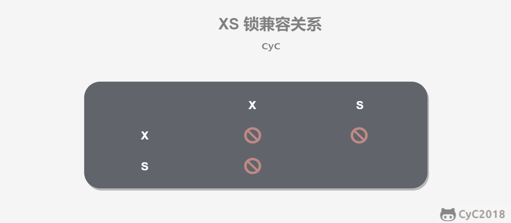
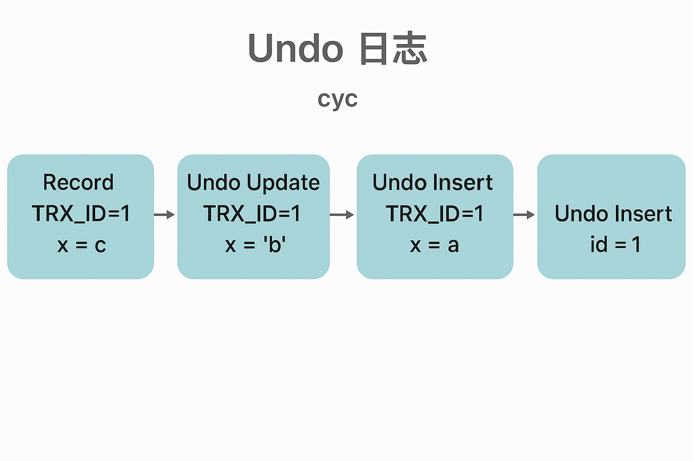

# 数据库

## 数据库系统原理

### 事务

> 事务指的是满足ACID特性的一组操作，可以通过 Commit 提交一个事务，也可以使用 Rollback 进行回滚。
>
> ACID特征：
>
> 1. 原子性：事务被视为不可分割的最小单元，事务的所有操作要么全部提交成功，要么全部失败回滚
> 2. 一致性：ACID一致性确保了在并发事务执行时，数据库的状态保持一致，不会出现数据混乱或不一致的情况
> 3. 隔离性：一个事务做的操作在提交之前别的事务是不可见的
> 4. 持久性：事务一旦提交了，其做的修改将会永远保存在数据库中，即使系统发生崩溃，事务执行的结果也不能丢

### 并发一致性问题

> 1. 丢失修改：事务T1在对数据A进行修改还没提交，T2随即对数据A进行修改并提交，覆盖了事务T1的修改
> 2. 读脏数据：事务T2读取到了事务T1修改了但是还没提交的数据，如果T1此时进行回滚的话，那么T2读到的就是脏数据
> 3. 不可重复读：事务T2读取数据A后还没结束事务，事务T1在事务T2还没结束的时候修改数据A，T2再次读取数据A的时候发现前后两次读取的数据A的结果不一致
> 4. 幻读：和不可重复读很类似，事务T2读取了一个范围的数据（例如根据数据库的语句匹配对应的数据），此时事务T1在这个范围内插入新的数据，导致T1和T2前后两次读取的数据不一致

<mark>产生并发不一致的问题主要原因是破坏了事务的隔离性，解决办法是通过并发控制来保证隔离性，并发控制可以通过封锁来实现。</mark>

### 封锁

**封锁粒度**

MySQL中提供了两种封锁的粒度：行级锁和表级锁

> 在加锁的时候需要注意只锁定需要修改的那部分数据，而不是所有的资源。锁的数据越少，发生锁争用的可能越小，并发程度越高
>
> 加锁需要消耗资源，锁的各种操作都会增加系统开销，所以封锁粒度越小，系统开销越大

**封锁类型**

是锁的粒度和作用范围

读写锁

- 互斥锁（Exclusive），简写为 X 锁，又称写锁。
- 共享锁（Shared），简写为 S 锁，又称读锁。

> 两个规定：
> 事务T1对数据A加了X锁，其他事务就不能对数据A加任何锁
>
> 事务T1对数据A加了S锁，其他事务可以对数据A加S锁，但是不能加X锁



意向锁

意向锁是IX/IS锁，这个表示当前事务<mark>有意向</mark>对数据A进行写/读操作

> 两个规定：
>
> 事务在获得某个数据行对象的 S 锁之前，必须先获得表的 IS 锁或者更强的锁；
>
> 事务在获得某个数据行对象的 X 锁之前，必须先获得表的 IX 锁。


> 1. X锁和其他所有的锁都是不可兼容的
>
> 2. IX锁是表级锁，会对整个表进行加锁，如果此时已经有X锁（行级锁）的话，表明有事务对某一行数据进行修改，就不能再加上表级锁，所以IX和X锁是不兼容的。IX锁表示事务有意愿对数据进行修改，那么就不可以进行S操作。
> 3. S锁加上后不能进行X/IX写操作
> 4. IS锁不能和X兼容

### 封锁协议

封锁协议是一种规定，描述了事务在何时、如何获取和释放锁以及允许哪些类型的锁，以确保数据库操作的一致性和隔离性。

**三级封锁协议**

> 1. 一级封锁协议：事务T要对数据A修改必须加上X锁，直到事务结束才释放，可解决丢失修改的问题（因为不能有两个事务对同一数据进行修改）
> 2. 二级封锁协议：在一级封锁协议的基础上，要求读取数据A必须加上S锁，读完马上释放S锁，可以解决读取脏数据的问题。
> 3. 三级封锁协议：在二级的基础上，要求读取数据A必须加上S锁，直到事务结束后释放，可解决不可重复读的问题。

**两段锁协议**

两段锁协议是可串行化调度（事务并发执行的结果和事务按照顺序串行执行的结果是一致的）的充分条件

> 加锁和解锁分为两个阶段运行
>
> 一次性加锁然后一次性解锁
>
> 例如：
>
> lock-x(A)...lock-s(B)...lock-s(C)...unlock(A)...unlock(C)...unlock(B) # A B C表示的是资源的名称

**MySQL隐式和显式锁定**

MySQL的InnoDB存储引擎<mark>（存储引擎决定着数据库如何存储和管理数据）</mark>>采用的是两段锁协议，会根据隔离级别在需要的时候自动加锁，并且所有的锁都是同一时间释放，这叫做隐式锁定

InnoDB 也可以使用特定的语句进行显示锁定：

```sql
SELECT ... LOCK In SHARE MODE;
SELECT ... FOR UPDATE;
```

### 隔离级别

**未提交读**

> 事务对数据的修改，即使还没提交，对于其他事务也是可见的

**提交读**

> 事务对数据的修改，在提交前对其他事务是不可见的

**可重复读**

> 保证同一个事务多次读取同一个数据的结果都是一样的

**可串行化**

> 强制事务串行执行，这样事务之间互不干扰，就不会出现不一致的问题


### 多版本并发控制（MVCC）

多版本并发控制（Multi-Version Concurrency Control, MVCC）是 MySQL 的 InnoDB 存储引擎实现隔离级别的一种具体方式，用于实现提交读和可重复读这两种隔离级别。

> 由于在实际应用中，读操作比写操作要频繁很多，所以MVCC中写操作去读取最新的版本快照，读操作去读旧版本的快照
>
> 在 MVCC 中事务的修改操作（DELETE、INSERT、UPDATE）会为数据行新增一个版本快照。为了解决脏读和不可重复读的问题，MVCC 规定只能读取已经提交的快照

**版本号**

> 系统版本号 SYS_ID：是一个递增的数字，每开始一个新的事务，系统版本号就会自动递增。
>
> 事务版本号 TRX_ID ：事务开始时的系统版本号。
>
> 
>
> 由于在MVCC中规定事务的读操作读的时候事务开始时的快照，所以系统的版本号就会对应的是事务初始时的快照，供读操作使用
>
> 而事务版本号就对应着事务对数据进行哪些操作的记录
>
> 
>
> <mark>注意！！！</mark>
>
> 事务版本号TRX_ID开始的时候是由系统版本号SYS_ID得到的，所以开始的时候TRX_ID是等于SYS_ID的，但是SYS_ID是会随着事务而增加的，但是TRX_ID就不会变化。

**Undo日志**

MVCC的多版本指的是多个版本的快照，快照存储在Undo日志中，该日志通过回滚指针 ROLL_PTR 把一个数据行的所有快照连接起来。

例如在 MySQL 创建一个表 t，包含主键 id 和一个字段 x。我们先插入一个数据行，然后对该数据行执行两次更新操作。

```sql
INSERT INTO t(id, x) VALUES(1, "a");
UPDATE t SET x="b" WHERE id=1;
UPDATE t SET x="c" WHERE id=1;


#  这个是START TRANSACTION的用法

START TRANSACTION;

INSERT INTO t(id, x) VALUES(1, "a");
UPDATE t SET x="b" WHERE id=1;
UPDATE t SET x="c" WHERE id=1;

COMMIT;

```

上面没有用START TRANSACTION是将操作当成一个事务来执行，根据 MySQL 的 AUTOCOMMIT 机制，每个操作都会被当成一个事务来执行，所以上面的操作总共涉及到三个事务。快照中除了记录事务版本号 TRX_ID 和操作之外，还记录了一个 bit 的 DEL 字段，用于标记是否被删除。（如果有用START TRANSACTION那么就是所有的操作当成一个事务来处理。）


如果加上START TRANSACTION的话Undo日志如下，都是同一个TRX_ID的。



INSERT、UPDATE、DELETE 操作会创建一个日志，并将事务版本号 TRX_ID 写入。DELETE 可以看成是一个特殊的 UPDATE，还会额外将 DEL 字段设置为 1。

**ReadView**

MVCC维护了额一个ReanView结构，里面包含着当前系统未提交的事务列表TRX_IDs {TRX_ID_1, TRX_ID_2, ...}，还有该列表的的最小值TRX_ID_MIN 和最大值 TRX_ID_MAX（不代表在TRX_ID_MIN 和TRX_ID_MAX区间内的所有事务都是活跃的，有的事务可能是已经提交了的）。

在进行SELECT操作的时候，会根据数据行快照的 TRX_ID 与 TRX_ID_MIN 和 TRX_ID_MAX 之间的关系，从而判断数据行快照TRX_ID 是否可以使用（每一行数据都有一个TRX_ID，这个ID表示这行数据最后一次被修改的事务是哪个）

TRX_ID 与 TRX_ID_MIN 和 TRX_ID_MAX 之间的关系

1. TRX_ID < TRX_ID_MIN：表明当前行数据最后一次修改的时候是在事务创建之前就被提交了，那么当前行数据就是可以被访问的
2. TRX_ID > TRX_ID_MAX：表明当前行数据最后一次修改的时候是在当前事务之后的事务创建的，根据MVCC的规则，当前事务在其快照中只看到在它启动前提交的事务所做的修改；而那些在其启动之后发生的修改，无论以后是否提交，都不会在当前事务的快照中显示。
3. TRX_ID_MIN <= TRX_ID <= TRX_ID_MAX，需要根据隔离级别再进行判断：

- <mark>提交读</mark>：如果TRX_ID是在TRX_IDs（即活跃事务）内部的，则表明当前行对应的事务还没提交，当前快照不可用。如果TRX_ID不在TRX_IDs里面的，那么就说明已经提交了，那么当前快照可以用。
- <mark>可重复读</mark>：无论TRX_ID是否在TRX_IDs里面都是，快照都是不可使用的，因为如果可以使用的话，那么其它事务也可以读到这个数据行快照并进行修改，那么当前事务再去读这个数据行得到的值就会发生改变，也就是出现了不可重复读问题

如果在数据行快照不可使用的情况下，需要沿着 Undo Log 的回滚指针 ROLL_PTR 找到下一个快照（下一个快照就是比当前数据行修改更早的快照，因为后面修改的就是在头部的位置）

**快照读与当前读**

1. 快照读：MVCC的SELECT操作是快照中的数据，不需要进行加锁的
2. 当前读：MVCC其他会对数据库进行修改的操作（INSERT、UPDATE、DELETE）需要加锁

```sql
SELECT * FROM table WHERE ? lock in share mode;   # 这个是对读操作进行加锁
SELECT * FROM table WHERE ? for update;           # 如果要修改的话这个是对写操作进行加锁
```

> SELECT * FROM table WHERE ? for update; 
>
> 在（INSERT、UPDATE、DELETE）操作的时候，系统会自动的帮我们加上排他锁，加上这种显式锁可以实现下面的操作：
>
> 需要根据读取的数据来判断是否要读最新的数据，因为如果不加上显式锁的话读完了就会释放锁，那么就无法根据条件判断是否需要读取最新的数据。（但是INSERT操作不需要加上SELECT * FROM table WHERE ? for update;，因为这个是适用于对已经存在的数据进行加锁操作）

## Next-Key Locks

MVCC只能保证已存在的数据的固定版本，但是幻影读是插入新的数据，MVCC对这种插入新的数据是无法解决幻影读问题的。使用 MVCC + Next-Key Locks 可以解决幻读问题。

### Record Locks

锁定一个记录上的索引，而不是记录本身。如果表没有设置索引，InnoDB 会自动在主键上创建隐藏的聚簇索引，因此 Record Locks 依然可以使用。

### Gap Locks

锁定索引之间的间隙，但是不包含索引本身。什么是索引之间的间隙呢，就是比如当前查找的数据对应的索引是10-20，那么如果加上gap锁的话，10-20的索引就不会被修改（如果我此时想要插入索引位15的值就会被拒绝）

### Next-Key Locks

是Record Locks和Gap Locks的结合，不仅锁定的是一个记录的索引，也锁定索引之间的间隙。锁定的是一个前开后闭区间

## 关系数据库设计理论

关系数据库和非关系数据库的区别：

**关系数据库**：基于表结构、关系模型和 SQL 查询语言，强调数据完整性和事务一致性，适合复杂业务逻辑且数据关系固定的场景。

**非关系数据库**：采用灵活的数据模型，不需要预定义模式，易于水平扩展，适合大规模数据和高并发应用的场景，同时支持多种数据类型和结构。

### 函数依赖

假设有一个关系 R，其中 X 和 Y 都是 R 的属性（或属性集）。如果对于 R 中的任意两个元组（记录），只要它们在 X 上的值相同，则它们在 Y 上的值也必然相同，我们就说 Y 函数依赖于 X。（就是X值相同的那么Y值也一定相同）

### 异常

- 冗余数据：例如 `学生-2` 出现了两次。
- 修改异常：修改了一个记录中的信息，但是另一个记录中相同的信息却没有被修改。
- 删除异常：删除一个信息，那么也会丢失其它信息。例如删除了 `课程-1` 需要删除第一行和第三行，那么 `学生-1` 的信息就会丢失。
- 插入异常：例如想要插入一个学生的信息，如果这个学生还没选课，那么就无法插入

### 范式

范式理论是为了解决上述提到的四种异常

可以参考https://blog.csdn.net/Sankkl1/article/details/129335961

> 平凡依赖表示的是若X->Y，且Y是X的子集，那么就是平凡依赖
>
> 非平凡依赖表示的是若X->Y，且Y不是X的子集，那么就是非平凡依赖

高级别范式的依赖于低级别的范式，1NF 是最低级别的范式。

1. 第一范式（1NF）

要求的是表中每个属性（字段）的值都是原子的，也就是说每个字段只能存储一个不可再分割的值。这一要求既适用于构成主键的属性，也适用于非键属性

2.  第二范式 (2NF)

在满足第一范式的情况下，数据库中的每一列都和主键相关，而不能只和主键的某一部分相关（主要是在联合主键的情况下）。若某个非主键属性 X 只依赖于 A 或 B 的一部分，而不是同时依赖 A 和 B，那么就存在部分依赖，那么就不满足第二范式。

3. 第三范式（3NF）

满足前面两个范式的情况下同时还要满足，不能有传递依赖。例如A->B B->C，但是A不能直接推出C（得借助B才可以）

传递依赖是：A->B B->C，这个就是传递依赖

4. BCNF范式

对于每个非平凡的函数依赖 X → Y，X 必须是一个超键，也就是能唯一标识记录的属性或属性组合，就是X不能是复合主键

就是如果有A、B、C三个键的话，A->C，那么A一定是主键并且A->B

## ER图

Entity-Relationship，有三个组成部分：实体、属性、联系

###  实体的三种联系

包含一对一，一对多，多对多三种

- 如果 A 到 B 是一对多关系，那么画个带箭头的线段指向 B；
- 如果是一对一，画两个带箭头的线段；
- 如果是多对多，画两个不带箭头的线段。

###  表示出现多次的关系

一个实体在联系出现几次，就要用几条线连接。下图表示一个课程的先修关系，先修关系出现两个 Course 实体，第一个是先修课程，后一个是后修课程，因此需要用两条线来表示这种关系。 `Predecessor` 和 `Successor` 是 实体在关系中的“角色名”


### 联系的多向性

联系是菱形的

虽然老师可以开设多门课，并且可以教授多名学生，但是对于特定的学生和课程，只有一个老师教授，这就构成了一个三元联系。


###  表示子类

用一个三角形和两条线来连接类和子类，与子类有关的属性和联系都连到子类上，而与父类和子类都有关的连到父类上。

