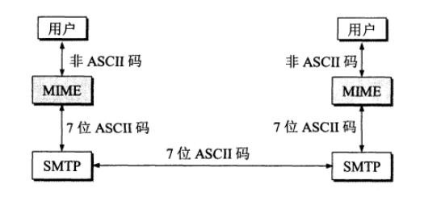

# 计算机网络

## 链路层

### 基本问题

封装成帧：

> 将网络层的数据加上帧首部和尾部，表示数据帧的开始和结束

差错检测（CRC）

> 采用循环冗余（CRC）来检查比特错误
>
> 
>
>
> 发送方和接收方协商得到除数q，如果除数是五位数的话，那么余数r就是四位数。
>
> 假设原始数据是A的话，那么A = q*k + r
>
> 那么发送出去的数据B就是B = A + r
>
> 然后用B / q如果得到的结果是0的话，那么消息就是正确的，否则错误

### 信道分类

广播信道

> 所有节点都在一个信道上发送数据（容易产生冲突，所以需要专门的控制方法进行协调）
>
> 控制方法：信道复用技术，CSMA/CD协议

点对点信道

> 一对一通信，不要产生碰撞，使用PPP协议进行控制

### 信道复用技术

是为了解决广播信道的问题

频分复用

> 所有主机在<mark>相同的时间</mark>占用<mark>不同的频率带宽</mark>资源

时分复用

> 所有主机在<mark>不同的时间</mark>占用<mark>相同的频率带宽</mark>资源（固定好顺序的例如ABCABC这样交替进行）

统计时分复用

> 对时分复用的改进，不固定顺序，例如数据够了据组成帧并发送

波分复用

> 利用不同波长的光信号在同一根光纤中传输多路信号

码分复用

> <mark>同时允许多个用户在同一频带同时发送各自的信号</mark>
>
> <mark>所以一个用户会收到所有当前信道的信号，需要和自己的码片进行相乘，如果为0就不是自己的信号，如果是1，那么就是1，-1就是0</mark>
>
> 为每个用户分配一个码片，且任意的两个码片正交
>
> 在计算的时候码片的0当成-1，1当成+1（例如 00011011 计算的时候就是（-1 -1 -1 +1 +1 -1 +1 +1））
>
> 如果码片为S，那么当用户要发送比特1的话就是发送S，用户要发送比特0的话，就发送码片的反码S'

### CSMA/CD协议

CSMA/CD表示载波监听多点接入/碰撞测试

> 载波监听表示每个主机都得不停的监听信道，发送数据前得查看信道是否被使用
>
> 多点接入表示主机以多点的方式连接到总线上
>
> 碰撞测试表示在发送的时候监听到信道上有其他主机在发送数据，那么就表示发生碰撞（因为存在传播时延）
>
> 
>
> 原理：
>
> 假设端到端的传播时延为t，那么2t就是争用期
>
> 当发生碰撞时，站点要停止发送，等待一段时间再发送。这个时间采用 <mark>截断二进制指数退避算法</mark>来确定。从离散的整数集合 {0, 1, .., (2k-1)} 中随机取出一个数，记作 r，然后取 r 倍的争用期作为重传等待时间。

### PPP协议

PPP协议用于一对一通信

> 互联网用户通常需要连接到某个 ISP 之后才能接入到互联网，PPP 协议是用户计算机和 ISP 进行通信时所使用的数据链路层协议。
>
> 帧格式是F A C 协议 IP数据报 FCS F
>
> 
>
>
> 其中F表示帧的首尾
>
> A C无意义
>
> FCS用于进行CRC检验

### MAC地址

每个网络适配器都有一个MAC地址，用于唯一标识网络适配器（网卡）

### 局域网

局域网是典型的广播信道，主要有以太网，令牌环网，FDDI和ATM等局域网技术

按照网络拓朴结构，局域网分为星型，环型以及直线型

### 以太网

以太网就是星型拓扑结构局域网

早期用的是集线器，集线器是对比特进行操作而不是帧，现在用交换机代替集线器

以太网帧的格式

> 以太网帧格式：
>
> 目的地址 源地址 类型 IP数据报 FCS
>
> 类型标记上层使用的协议
>
> FCS进行CRC检验

### 交换机

交换机具有自学习的能力，学习的是交换表的内容，交换表中存储着MAC地址到交换机接口的映射

### 虚拟局域网

是为了解决交换机出现的广播帧的问题

通过将局域网从逻辑上划分成为多个小的虚拟局域网VLAN，VLAN之间无法直接互通所以广播的报文会被限制在一个VLAN里面

## 网络层

### 基础

使用IP协议可以将异构的物理网络连接起来，使得在网络层看起来是一个统一的网络

与IP协议配套使用的还有三个协议：

> 地址解析协议（ARP）：将IP地址转换成为MAC地址
>
> 网际控制报文协议（ICMP）：如果目标主机不可达，那么会通过路由器告诉源主机目标主机不可达
>
> 网际组管理协议（IGMP）：IGMP用于管理IP多播组的成员资格。通过IGMP，主机可以向所在网络的路由器报告自己希望加入或退出某个多播组，从而使得网络能有效地传送多播数据。

IP数据报格式

> **版本**：IPv4还是IPv6
>
> **首部长度**：指的是整个首部有多长，单位是32bit，例如0001等于1就表示整个首部的长度为32bit
>
> **区分服务**：一般不使用
>
> **总长度**：包括首部长度和数据部分的长度
>
> 
>
> **生存时间（TTL）**：指的是路由器的跳数，TTL=0则丢弃数据包
>
> 
>
> **协议**：表示数据包封装的是哪一种协议（TCP，UDP，ICMP）
>
> <mark>如果协议是ICMP的话，那么数据部分就是ICMP的数据</mark>
>
>
> **标识**：数据长度过大需要切片的时候，相同数据报的不同分片具有相同的标识符
>
>
> **标志**：三位，第二位为是否允许分片，1则不能分片，最后一位表示如果分片是否有其他分片，0的话则表示这是数据报的最后一个分片
>
>
> **片偏移**：指的是当前分片的数据在原始数据中的开始位置
>
>
> **首部检验和**：当数据报每经过一个路由器，都要重新计算检验和，所以计算的时候不包含数据部分，减少计算的工作量

### IP地址编址方式

**分类IP地址**

> 分为ABCDE五个地址
>
> A类地址：8位网络号（0开头），24位主机号
>
> 
>
> B类地址：16位网络号（10开头），16位主机号
>
> 
>
> C类地址：24位网络号（110开头），8位主机号
>
> 
>
> D类地址：1110（开头）多播地址
>
> 
>
> E类地址：1111（开头）暂时还未使用

**子网划分**

<mark>将主机字段拿一部分作为子网号</mark>

> IP 地址 ::= {< 网络号 >, < 子网号 >, < 主机号 >}

**无分类**

无分类取消了地址ABCDE的分类，无分类叫做CIDR

> CIDR是在IP地址后面加上网络前缀的长度
>
>
> 128.14.35.7/20 表示的是前20位为网络号，后12位为主机号

### 地址解析协议ARP

ARP实现的是由IP地址得到对应的MAC地址

> 每个主机都有一个 ARP 高速缓存，里面有本局域网上的各主机和路由器的 IP 地址到 MAC 地址的映射表

### 网际控制报文协议ICMP

ICMP是封装在IP数据部分的，不属于高层协议

前32bit（四个字节是统一的）

> **类型**表示的是差错报文还是询问报文
>
> 
>
> **代码**表示的是类型中的具体哪一个，因为类型里面还有划分
>
>
> **检验和**表示的是对数据进行校验，判断传输过程是否出错

Ping

> 原理：ping向目的主机发送ICMP Echo请求报文，目的主机收到后发送Echo回答报文

Traceroute

> 原理：源主机向目的主机发送一连串的数据报
>
>
> 第一个数据报的TTL设置为1，当到达第一个路由器之后TTL-1=0，那么路由器就会将这个数据报丢弃，并发送不可达错误（这个相当于是路由器的相应），通过路由器的响应也可以知道源主机到达第一个路由器的时间。
>
> 
>
> 第二个数据报的TTL设置为2，数据报先到达 R1，R1 收下后把 TTL 减 1 再转发给 R2，R2 收下后也把 TTL 减 1，由于此时 TTL 等于 0，R2 就丢弃 数据报，并向源主机发送一个 ICMP 时间超过差错报文（用于丢弃数据报以及计算往返这个路由器的时间）。
>
> 
>
> 不断执行上述的步骤，到达目的主机的时候不将TTL减1，但是要想源主机发送ICMP不可达的错误报文。

### 虚拟专用网VPN

因为IP地址短缺，所以机构能申请到的IP地址的数量远远小于本机构拥有的主机数。并且机构内不需要所有的主机都接入到外部的互联网中，机构内的计算机可以使用仅在本机构有效的IP地址。

> 专用网指的是为通过专线或VPN隧道等方式保证安全和隔离，但本质上是一个**私有网络**，并不只指“为源主机和目的主机建立的专用信道”。
>
> 虚拟VPN技术一般采用的是加密和隧道技术
>
>
> 可以实现两个具有内部私有地址的位于不同局域网的主机间的通信
>
> 例如：场所 A 和 B 的通信经过互联网，如果场所 A 的主机 X 要和另一个场所 B 的主机 Y 通信，IP 数据报的源地址是 10.1.0.1，目的地址是 10.2.0.3。数据报先发送到与互联网相连的路由器 R1，R1 对内部数据进行加密，然后重新加上数据报的首部，源地址是路由器 R1 的全球地址 125.1.2.3，目的地址是路由器 R2 的全球地址 194.4.5.6。路由器 R2 收到数据报后将数据部分进行解密，恢复原来的数据报，此时目的地址为 10.2.0.3，就交付给 Y。

### 网络地址转换NAT

以前的NAT是本地IP对应一个全球IP，这样不够有效
现在的NAT是加入端口号，利用端口号标识主机内的不同主机，例如40001对应一个IP地址及端口，40002是另一个

### 路由器的结构

路由器的主要功能：路由选择，分组转发

路由器的典型结构

### 路由器分组转发

> 从数据报的首部提取目的主机的 IP 地址 D，得到目的网络地址 N（分为下面几种情况）：
>
> 
>
> 如果N是与此路由器直接相连的网络地址，那么直接交付
>
> 
>
> 如果路由表中由目的主机D的特定主机路由，那么则将数据交给指明的下一跳路由器（这个是只针对一个IP的）
>
> 
>
> 如果路由表中有到达网络N的路由，那么则将数据报传送给指明的下一跳路由器（这个是针对一整个网段的）
>
>
> 如果路由表中有默认路由，那么就交给默认路由器
>
>
> 如果都没有则报告分组错误

### 路由选择协议

互联网可以划分为许多较小的自治系统 AS，一个 AS 可以使用一种和别的 AS 不同的路由选择协议。

可以把路由选择协议划分为两大类：

- 自治系统内部的路由选择：RIP 和 OSPF
- 自治系统间的路由选择：BGP

**RIP路由协议**

RIP最大距离是15，限制网络的规模

> 1. 每隔 30 秒左右，路由器会向所有相邻路由器广播自己的完整路由表。报文中每条记录包含目的网络、距离（跳数）和下一跳。
>
> 2. 路由器收到来自相邻路由器 X 的 RIP 报文后，先做两件事：
>
>    - 将报文中每条记录的“下一跳”字段都改为 X（因为下一跳经由 X）
>    - 将所有记录的距离（跳数）都 +1（因为经过 X 多走了一跳）
>
> 3. 如果本地路由表中还没有目的网络 N，则直接将 `(N, d, 下一跳=X)` 添加进来。
>
>    如果路由表中已有到 N 的条目，且它的“下一跳”正是 X，那么说明这条路由就是通过 X 学来的，此时无论距离如何变化，都用新收到的 `(N, d, X)` 覆盖原条目，以保持最新的距离信息。
>
>    如果已有到 N 的条目是经由其他路由器 Y 的 `(N, d0, Y)`，而新收到的 `(N, d, X)` 中 `d < d0`，说明通过 X 能到 N 的距离更短，则将原条目更新为 `(N, d, X)`。、
>
> 4. 路由器会对每个相邻路由器设置一个计时器：
>
>    - 如果 **连续 3 分钟**（默认超时）未收到某个相邻路由器的 RIP 报文，就认为它失联。
>    - 对应路由器 X 失联后，将所有“下一跳=X”的路由条目的距离置为 **无限大（在 RIP 中定义为16跳）**，并保留条目以便将来可能的恢复。

**OSPF内部网关协议**

> OSPF 具有以下特点：
>
> - 向本自治系统中的所有路由器发送信息，这种方法是洪泛法。
> - 发送的信息就是与相邻路由器的链路状态，链路状态包括与哪些路由器相连以及链路的度量，度量用费用、距离、时延、带宽等来表示。
> - 只有当链路状态发生变化时，路由器才会发送信息。
>
> 所有路由器都具有全网的拓扑结构图，并且是一致的。相比于 RIP，OSPF 的更新过程收敛的很快。

**BGP外部网关协议**

> AS 之间的路由选择很困难，主要是由于：
>
> - 互联网规模很大；
> - 各个 AS 内部使用不同的路由选择协议，无法准确定义路径的度量；
> - AS 之间的路由选择必须考虑有关的策略，比如有些 AS 不愿意让其它 AS 经过。
>
> BGP 只能寻找一条比较好的路由，而不是最佳路由。
>
> 每个 AS 都必须配置 BGP 发言人，通过在两个相邻 BGP 发言人之间建立 TCP 连接来交换路由信息。

## 传输层

网络层将分组送到目的主机，但是通信的是主机中的进程，传输层提供进程间的<mark>逻辑通信</mark>（指的是两个主机的进程看起来是在直接通信的，但是传输层不能在两个进程之间建立一条物理信道，所以是逻辑信道）

### UDP

<mark>伪首部不会传输出去，只会作为计算</mark>会将伪首部 + UDP头 + 数据 + 检验和得到全1的结果，然后将这个检验和加进数据报中，接收端通过计算检验和以及重新拼接成为的伪首部等看看结果是否是全1，是的话则说明数据报没有发生问题。

### TCP

TCP给进程分配端口，例如发送端端口随机为51232，然后接收端的https端口是443/http端口是80

> 序号：用于对字节进行编号，表示数据中第一个字节的编号是多少
>
>
> 确认号：期望收到的下一个报文段的序号
>
>
> 数据偏移：指的是数据部分距离报文起始位置的偏移量，其实就是首部的长度
>
>
> 确认ACK（不是确认号ack）：ACK=1则确认字号有效否则无效，在连接建立后所有传送的报文段都必须把 ACK置1
>
>
> 同步SYN：在连接建立时用来同步序号。当 SYN=1，ACK=0 时表示这是一个连接请求报文段。若对方同意建立连接，则响应报文中 SYN=1，ACK=1
>
>
> 终止FIN：用来释放一个连接，当 FIN=1 时，表示此报文段的发送方的数据已发送完毕，并要求释放连接。
>
>
> 窗口：由接收方决定的，接收方每发送一个确认号，里面就会告诉发送方缓存区内还能接收多少数据

### TCP三次握手

> 1. 发送方发送SYN=1，ACK=0，并选择一个初始序号x
> 2. 接收方接收信息后，如果同意连接的话就会向发送方发送SYN=1，ACK=1，ack=x+1，同时选择一个初始序号y
> 3. 发送方收到接收方的连接确认报文后，还要向 B 发出确认，确认号为 y+1，序号为 x+1。

**为什么需要三次握手呢**

> 为了防止失效的请求到达服务器，让服务器错误的打开连接
>
> 客户端发送的请求在网络中耽误了，所以就会很久才会受到服务端发挥的确认，如果在一个超时重传时间后客户端还没有收到确认后就会重新发送请求，如果没有三次握手的话，服务器就会打开两个连接，如果有三次握手就会服务器发送的对于滞留请求的连接确认。

### TCP四次挥手

> 1. 发送端发送连接释放报文，将FIN=1，seq=u（这里的u是最后一个数据报的相对位置）
> 2. 服务器接收到后发出确认，此时TCP属于半关闭状态，服务器还可以向客户端发送消息，但是客户端无法向服务器发送消息
> 3. 当 B 不再需要连接时，发送连接释放报文，FIN=1
> 4. A 收到后发出确认，进入 TIME-WAIT 状态，等待 2 MSL（最大报文存活时间）后释放连接
> 5. B 收到 A 的确认后释放连接

**四次挥手的原因**

> 防止服务器还有数据没有传输完，传输完成后，服务器就会发送FIN信号释放连接

**等待2个TIME_WAIT的原因**

> - 担心客户端发送的确认号服务端没有收到，那么服务器机会再次发送连接释放请求报文
> - 等待一段时间是为了让本连接持续时间内所产生的所有报文都从网络中消失，使得下一个新的连接不会出现旧的连接请求报文。

### TCP滑动窗口

窗口是缓存的一部分，用来暂时存放字节流。发送方和接收方各有一个窗口，接收方通过 TCP 报文段中的窗口字段告诉发送方自己的窗口大小，发送方根据这个值和其它信息设置自己的窗口大小。

> <mark>发送窗口内的字节都允许被发送，接收窗口内的字节都允许被接收。</mark>如果发送窗口左部的字节已经发送并且收到了确认，那么就将发送窗口向右滑动一定距离，直到左部第一个字节不是已发送并且已确认的状态；接收窗口的滑动类似，接收窗口左部字节已经发送确认并交付主机，就向右滑动接收窗口。
>
> <mark>接收窗口只会对窗口内最后一个按序到达的字节进行确认</mark>，例如接收窗口已经收到的字节为 {31, 34, 35}，其中 {31} 按序到达，而 {34, 35} 就不是，因此只对字节 31 进行确认。发送方得到一个字节的确认之后，就知道这个字节之前的所有字节都已经被接收。

### TCP流量控制

流量控制是为了控制发送方发送速率，保证接收方来得及接收。

接收方来决定发送方发送数据的速率

### TCP拥塞控制

> TCP流量控制是接收方告诉发送方自己还可以接收多少数据，而拥塞控制是发送方根据当前网络的拥堵程度自己决定拥塞窗口的大小
>
> **发送方窗口的大小=min（接收方通告窗口，拥塞窗口）**

发送方维护一个拥塞窗口（cwnd）的状态变量

拥塞窗口在不同阶段的变化如上图所示

> 1. 先执行慢开始与拥塞避免
>
> 刚刚开始的时候将cwnd设置为1，收到确认后，cwnd设置为2，收到确认后，cwnd设置为4然后8以此类推
>
> 这样cwnd会增长的很快，要设置一个阈值ssthresh，当cwnd > ssthresh的时候，进入拥塞避免，每次cwnd只加1
>
> 如果出现超时的话，那么ssthresh = cwnd/2，然后重新执行慢开始
>
> 2. 快重传和快恢复（快重传和快恢复是配套进行的，快重传完了之后马上变成快恢复）
>
> 在接收方，要求每次接收到报文段都应该对最后一个已收到的有序报文段进行确认。例如已经接收到 M1 和 M2，此时收到 M4，应当发送对 M2 的确认。
>
> 在发送方，如果收到<mark>三个重复确认</mark>，那么可以知道下一个报文段丢失，此时执行快重传，立即重传下一个报文段。例如收到三个 M2，则 M3 丢失，立即重传 M3。
>
> 在这种情况下，只是丢失个别报文段，而不是网络拥塞。因此执行快恢复，令 ssthresh = cwnd / 2 ，cwnd = ssthresh，注意到此时直接进入拥塞避免。
>
> **慢开始和快恢复的快慢指的是 cwnd 的设定值，而不是 cwnd 的增长速率。慢开始 cwnd 设定为 1，而快恢复 cwnd 设定为 ssthresh。**

## 应用层

### DNS域名解析协议

DNS提供主机名和IP地址之间相互转换的服务

DNS 可以使用 UDP 或者 TCP 进行传输，使用的端口号都为 53。大多数情况下 DNS 使用 UDP 进行传输，这就要求域名解析器和域名服务器都必须自己处理超时和重传从而保证可靠性。

### FTP文件传输协议

FTP 使用 TCP 进行连接，它需要两个连接来传送一个文件：

- 控制连接：服务器打开端口号 21 等待客户端的连接，客户端主动建立连接后，使用这个连接将客户端的命令传送给服务器，并传回服务器的应答。
- 数据连接：用来传送一个文件数据。

> 根据数据连接是否是服务器端主动建立，FTP 有主动和被动两种模式：
>
> 主动模式要求客户端开放端口号给服务器端，需要去配置客户端的防火墙。被动模式只需要服务器端开放端口号即可，无需客户端配置防火墙。但是被动模式会导致服务器端的安全性减弱，因为开放了过多的端口号。

### DHCP动态主机配置协议

**自动为主机分配 IP 地址及相关网络参数（如网关、DNS、子网掩码等）**

> 1. 客户端发送 Discover 报文，该报文的目的地址为 255.255.255.255:67，源地址为 0.0.0.0:68，被放入 UDP 中，该报文被广播到同一个子网的所有主机上。如果客户端和 DHCP 服务器不在同一个子网，就需要使用中继代理。
> 2. DHCP 服务器收到 Discover 报文之后，发送 Offer 报文给客户端，该报文包含了客户端所需要的信息。因为客户端<mark>可能收到多个 DHCP 服务器提供的信息</mark>，因此客户端需要进行选择。
> 3. 如果客户端选择了某个 DHCP 服务器提供的信息，那么就发送 Request 报文给该 DHCP 服务器。
> 4. DHCP 服务器发送 Ack 报文，表示客户端此时可以使用提供给它的信息。

### TELNET远程登陆协议

TELNET 用于登录到远程主机上，并且远程主机上的输出也会返回。

### 电子邮件协议

邮件协议包含发送协议和读取协议，**发送协议常用 SMTP，读取协议常用 POP3 和 IMAP。**采用的是TCP连接。

###  SMTP

SMTP 只能发送 ASCII 码，而互联网邮件扩充 MIME 可以发送二进制文件。

MIME 并没有改动或者取代 SMTP，而是可以将用户输入的非ASCII码转换成为ASCII码

### POP3

POP3特点是用户如果从服务器中读取了邮件之后，就会将邮件删除

### IMAP

IMAP 协议中客户端和服务器上的邮件保持同步，如果不手动删除邮件，那么服务器上的邮件也不会被删除。IMAP 这种做法可以让用户随时随地去访问服务器上的邮件。

### 常用端口

### WEB页面请求过程

**1. DHCP 自动获取网络配置**

- 主机开机时没有 IP 地址，使用 DHCP 协议向局域网广播请求（目的 IP 为 255.255.255.255，MAC 为 FF:FF:FF:FF:FF:FF）。
- DHCP 服务器接收到后，回应 DHCP ACK 包，分配 IP 地址、子网掩码、默认网关、DNS 等信息。
- 主机收到后配置网络参数，并将默认网关添加到自己的路由表中。

**2. ARP 获取网关 MAC 地址**

- 主机想发 DNS 查询，目标是 DNS 服务器的 IP，但不知道默认网关的 MAC 地址。
- 使用 ARP 协议广播请求，询问“谁是这个 IP？”。
- 网关响应 ARP Reply，主机获得网关 MAC地址。

**3. DNS 解析域名**

- 主机向 DNS 服务器发送 DNS 查询（UDP 53端口），请求解析域名为 IP 地址。
- 数据包通过网关、路由器转发到 DNS 服务器。
- DNS 服务器查询数据库，返回解析结果（目标网站 IP 地址）给主机。

**4. 建立 TCP 连接，发起 HTTP 请求**

- 主机使用解析到的 IP 地址与 Web 服务器建立 TCP 连接（三次握手）。
- 握手完成后，浏览器发送 HTTP GET 请求（目标端口 80）。
- Web 服务器处理请求，返回 HTTP 响应，包含网页内容。

**5. 显示网页**

- 主机接收到 HTTP 响应，浏览器提取网页数据并渲染显示。