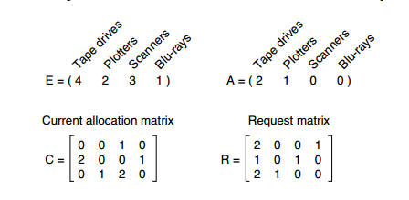

# 操作系统


## 概述

### 基本概念

**并发和并行**

> 并发指的是同一个宏观时间内能运行多个程序（单个CPU）
>
> 并行指的是同一时刻能运行多个指令（多个CPU）

**共享**

> 共享是指系统中的资源可以被多个并发进程共同使用。
>
> 
>
> 共享分为互斥共享和同时共享
>
> 互斥共享：资源只能被一个线程使用，所以互斥共享的资源叫做临界资源（CPU，写文件等操作）
> 同时共享：多个线程可以在同一时间访问资源，不会相互影响（查配置，读缓存等操作）

**虚拟**

> 虚拟技术是将一个物理实体转换成为多个逻辑实体
>
> 虚拟技术主要有：时分复用和空分复用
>
> 
>
> 多个进程能在一个处理器上并发执行用的是时分复用技术
>
> 虚拟内存采用的是空分复用技术

**异步**

> 异步指的是进程不是一次性执行完的，而是走走停停，以不可知的速度向前推进

### 基本功能

**进程管理**

> 进程控制、进程同步、进程通信、死锁处理、处理机调度等

**内存管理**

> 内存分配、地址映射、内存保护与共享、虚拟内存等

**文件管理**

> 文件存储空间管理，目录管理、文件读写管理和保护等

**设备管理**

> 完成用户的 I/O 请求，方便用户使用各种设备，并提高设备的利用率。
>
> 主要包括缓冲管理、设备分配、设备处理、虛拟设备等。

### 系统调用

系统调用将用户态切换为内核态，这个过程由操作系统处理，叫做系统调用（**从内核态到用户态不是系统调用**）


|   Task   | Commands                    |
| :------: | --------------------------- |
| 进程控制 | fork(); exit(); wait();     |
| 进程通信 | pipe(); shmget(); mmap();   |
| 文件操作 | open(); read(); write();    |
| 设备操作 | ioctl(); read(); write();   |
| 信息维护 | getpid(); alarm(); sleep(); |
|   安全   | chmod(); umask(); chown();  |

用户态和内核态需要频繁切换的原因

> 用户程序不能直接操作硬件或内存管理单元，只能请求内核代为执行，因此它**必然需要进入内核态**，但用完就走，**还得回来继续跑自己的代码**，所以就构成了这个经典的来回切换路径。

### 宏内核和微内核

> 宏内核：操作系统的所有核心功能都在内核态进行（运行速度快但是容易崩）
>
> 微内核：除了必要的功能在内核态运行，其他功能都在用户态运行（安全但是容易发生频繁的系统调用）

### 中断分类

**外中断**

> **外中断**是由**CPU 外部设备**发出的中断请求，
> 用于**提醒 CPU 有外部事件需要处理**，比如键盘输入、鼠标点击、网络数据到达等。
>
> 把 CPU 比作“大脑”，那么<mark>外部设备</mark>就是大脑的“感官和四肢”：
>
> - 键盘、鼠标 → 输入设备（手指/眼睛）
> - 显示器、打印机 → 输出设备（嘴/手）
> - 硬盘、SSD、内存 → 存储设备（记忆）
> - 网卡、声卡、定时器 → 通信/感知/调度模块

**异常**

> 由 CPU 执行指令的<mark>内部事件</mark>>引起，如非法操作码、地址越界、算术溢出等。

**陷入**

> 陷入（Trap）是一种“由程序主动发起的中断”，例如系统调用等

## 进程管理

### 进程和线程

**进程**

> 进程是<mark>资源分配</mark>>的基本单位
>
> 进程控制（PCB）描述进程的基本信息和运行状态，创建和撤销进程就是对PCB进行操作

**线程**

> 线程是<mark>独立调度</mark>>的基本单位
>
> 一个进程可以有多个线程，它们共享进程资源
>
> 例如：QQ和浏览器是两个进程，浏览器里面有很多线程，例如HTTP请求线程、事件响应线程等

**区别**

> 1. 进程是资源分配的基本单位，但是线程不拥有资源，线程可以访问进程的资源
>
> 2. 线程是调度得到基本单位，在一个进程内，线程的切换不会引起进程切换，但是从一个进程中的线程到另一个进程中的线程就会引起进程切换
>
> 3. 创建或撤销进程，系统都要为之分配或回收资源，如内存空间、I/O设备等。撤销线程的时候只需要将其从调度队列中删除、释放线程的栈空间以及清理线程私有数据。所以创建和删除进程的开销比创建或删除线程的开销大多了。在进行进程切换的时候需要执行CPU环境的保存和新进程CPU环境的设置，而线程切换只需保存以及设置少量寄存器，开销小
> 4. 同一个进程中的线程间可以直接读取进程中的数据进行通信，但是进程通信需要借助IPC。所以不同的进程中的线程进行通信需要借助的是IPC即进程间通信。

### 进程状态的切换

就绪态：等待CPU资源

运行态：正在占用CPU资源

阻塞态：等待除了CPU以外的其他资源（I/O等）

就绪态和运行态是可以相互转换的，其他的都是单向转换


### 进程调度算法

需要根据<mark>用户操作多还是少</mark>>来讨论调度算法

**批处理系统（用户操作少）**

> 1. 先来先服务
>
> 非抢占式的调度算法，按照请求的顺序进行调度，有利于长作业但是不利于短作业。因为短作业要一直等到长作业执行完。
>
> 2. 短作业优先
>
> 非抢占式的调度算法，运行时间最短的作业优先，长作业有可能会饿死，有短作业来，那么长作业就会一直得不到调度。
>
> 3. 最短剩余时间优先
>
> 抢占式的调度算法，按剩余运行时间的顺序进行调度。对短作业比较友好，长作业可能会一直等。

**交互式系统（有大量的用户交互操作）**

> 1. 时间片轮转
>
> 将所有就绪进程按FCFS的原则排成一个队列，每次调度时，把 CPU 时间分配给队首进程，该进程执行一个时间片。当时间片用完时，由计时器发出时钟中断，调度程序便停止该进程的执行，并将它送往就绪队列的末尾，同时继续把 CPU 时间分配给队首进程。
>
> （时间片轮转和时间片的大小有关系，时间片太小会导致进程）
>
> 2. 优先级调度
>
> 为每一个进程分配一个优先级，按优先级进行调度
>
> 为了防止低优先级的进程永远等不到调度，可以随着时间的推移增加等待进程的优先级
>
> 3. 多级反馈队列
>
> 多级反馈队列通过多层优先级队列+时间片调度+动态降级（或升级）机制，智能地区分短作业和长作业

**实时系统**

> 实时系统要求一个请求在一个确定时间内得到响应
>
> 分为软实时和硬实时，前者必须满足绝对的截止时间，后者可以容忍一定的超时

### 进程同步

**临界区**

> 对临界资源进行访问的那段代码成为临界区，为了互斥访问临界资源，每个进程在进入临界区之前都需要进行检查

**同步和互斥**

> 同步：多个进程因为合作关系产生的直接制约关系，使得进程有一定的先后执行关系
>
> 互斥：多个进程在同一时刻只有一个进程可以进入临界区

**信号量**

信号量是一个整型变量，可以对其执行down和up操作，也就是P和V操作

> down：如果信号量大于0则减1；如果信号量等于0，则进程睡眠，等待信号量大于0
>
> up：对信号量执行加1操作，唤醒睡眠的进程
>
>
> down是请求资源
>
> up是释放资源
>
>
> 如果信号量的取值是<mark>0 / 1</mark>，那么就变成<mark>互斥量</mark>>，0表示临界区已经加锁，1表示临界区解锁

**使用信号量实现生产者-消费者问题**

生产者消费者问题是：使用一个缓冲区来保存物品，只有缓冲区没有满，生产者才可以放入物品；只有缓冲区不为空，消费者才可以拿走物品

> 缓冲区属于临界资源，所以需要一个互斥量mutex来控制对缓冲区的访问
>
> 使用两个信号量来记录缓冲区的数量，empty记录空缓冲区的数量（还可以放多少东西），full记录满缓冲区的数量（还有多少东西没被取走）
>
>
> 当empty不为0的时候，生产者才可以放入东西；当full不为0的时候，消费者才可以取走东西。
>
>
> 注意：
>
> 1. <mark>不能对缓冲区先加锁再测试信号量，这是因为如果先对临界区加锁的话，如果empty=0或者full=0的话就会导致线程会一直等待，但是此时临界区已经被上锁了，其他进程想要加入东西或者取走东西也无法实现，会陷入死锁</mark>
>
> 2. <mark>up(mutex)和up(full)是可以调换顺序的，不会影响正确性的。但是建议先释放锁再唤醒进程（先up(mutex)再up(full)），如果先唤醒进程再释放锁（up(full)再up(mutex)）的话会导致进程被唤醒后等待进入临界区，增加等待时间</mark>

伪代码如下：

```python
mutex = 1
empty = N
full = 0
    
def producer(){
	down(empty)
    down(mutex)
    do something...
    up(mutex)
    up(full)
  }

def consumer(){
    down(full)
    down(mutex)
    do smoething...
    up(mutex)
    up(empty)
}
```

**管道**

使用信号量机制实现的生产者消费者问题需要客户端代码做很多控制，而管程把控制的代码独立出来，不仅不容易出错，也使得客户端代码调用更容易。下面是用pascal语言实现一个管道

```pascal
// 定义一个管道，然后里面封装着缓冲区、计数器和对它们的操作
monitor ProducerConsumer
    condition full, empty;
    integer count := 0;
    condition c;

    procedure insert(item: integer);
    begin
        if count = N then wait(full);
        insert_item(item);
        count := count + 1;
        if count = 1 then signal(empty);
    end;

    function remove: integer;
    begin
        if count = 0 then wait(empty);
        remove = remove_item;
        count := count - 1;
        if count = N -1 then signal(full);
    end;
end monitor;

// 生产者客户端，调用定义的管道函数
procedure producer
begin
    while true do
    begin
        item = produce_item;
        ProducerConsumer.insert(item);
    end
end;

// 消费者客户端，调用定义的管道函数
procedure consumer
begin
    while true do
    begin
        item = ProducerConsumer.remove;
        consume_item(item);
    end
end;
```

### 经典同步问题

**哲学家就餐问题**

五个哲学家围着一张圆桌，每个哲学家面前放着食物。哲学家的生活有两种交替活动：吃饭以及思考。当一个哲学家吃饭时，需要先拿起自己左右两边的两根筷子，并且一次只能拿起一根筷子。

> 思路是:
>
> 1. 先检查自己本身是不是处于饥饿状态并且左右邻居都不是吃饭状态，是的话则唤醒自己
> 2. 拿起筷子的时候先拿锁，然后修改自身状态为hungry，并调用检查函数，检查是否可以进食，不行的话就阻塞自己，释放锁
> 3. 放下筷子的时候先拿锁，并修改自身状态为thinking，并调用检查函数，检查左右邻居，告诉左右邻居自己吃好了，释放锁

```python
n = 5
mutex = 1
left = (i + n - 1) % n
right = (i + 1) % n


def check(i){
    if state[i] == hungry and state[left] != eating and state[right] != eating:
        up(s[i])
}

def take(i){
    down(mutex)
    state[i] = hungry
    check(i)
    up(mutex)
    down(s[i])
}

def put(i){
    down(mutex)
    state[i]= thinking
    check(left)
    check(right)
    up(mutex)
}
```

**读者写者问题**

允许多个进程同时对数据进行读操作，但是不允许读和写以及写和写操作同时发生。

> 思路是：
>
> 1. 使用一个count来记录读者的数量，并且用count_mutex锁对count进行加锁，控制加1和减1的操作
> 2. 使用一个data_mutex实现对缓冲区读和写操作的加锁

```python
count = 0
count_mutex = 1
data_mutex = 1

def read(){

    while True:
        down(count_mutex)
        count += 1
        if count == 1:
            down(data_mutex)
        up(count_mutex)
        
        do_read()
        
        down(count_mutex)
        count -= 1
        if count == 0:
            up(data_mutex)
        up(count_mutex)
}

def write(){
    while True:
        down(data_mutex)
        do_write()
        up(data_mutex)
}
```

但是上述的代码是经典的读者优先，一旦有源源不断的读者到来，那么写者就会一直阻塞，导致饿死的状态，下面的是改进版本

```python
read_count = 0 	#  计算读者的数量
write_count = 0	#  计算写者的数量
data_mutex = 1 	#  资源锁
read_mutex = 1 	#  读者锁，对于读者count的修改
write_mutex = 1	#  写者锁，对于写者count的修改
read_lock = 1   #  读者锁，防止写者饿死

def read(){
    while True:
        down(read_lock)
        down(read_mutex)
        read_count += 1
        if (read_count) == 1:
            down(data_mutex)
        up(read_mutex)
        up(read_lock)   # 没有释放的话，其他读者不能进入，就变成串行了

        do_read()

        down(read_mutex)
        read_count -= 1
        if read_count == 0:
    		up(data_mutex)
    	up(read_mutex)
}

def write(){
    while True:
    	down(write_mutex)
    	write_count += 1
    	if write_count == 1:
    		down(read_lock)
    	up(write_mutex)
    	
    	donw(data_mutex)
    	do_write()
    	up(data_mutex)
    	
    	down(write_nutex)
    	write_count -= 1
    	if write_count == 0:
    		up(read_lock)
    	up(write_mutex)
}
```

### 进程通信

进程同步和进程通信不一样

- 进程同步：控制多个进程按一定顺序执行；
- 进程通信：进程间传输信息。

<mark>进程之间通信可以传递进程同步所需要的信息</mark>

**管道**

管道只能用于父子进程的通信

```c
#include <stdlib.h>
#include <stdio.h>
#include <unistd.h>
#include <string.h>
#include <sys/types.h>
#include <sys/wait.h>

#define STRING "hello world!"

int main()
{
	int pipefd[2];
	pid_t pid;
	char buf[BUFSIZ];

	if (pipe(pipefd) == -1) {
		perror("pipe()");
		exit(1);
	}

	pid = fork();
	if (pid == -1) {
		perror("fork()");
		exit(1);
	}

    // pid=0是子进程，父进程有自己的pid
	if (pid == 0) {
		/* this is child. */
		printf("Child pid is: %d\n", getpid());
        // read(pipefd[0], buf, BUFSIZ的结果会返回实际读取的字节数
		if (read(pipefd[0], buf, BUFSIZ) < 0) {
			perror("write()");
			exit(1);
		}

		printf("%s\n", buf);

		bzero(buf, BUFSIZ);
		snprintf(buf, BUFSIZ, "Message from child: My pid is: %d", getpid());
        // snprintf后面的参数意思是：buf表示的是要写到哪里去，BUFSIZ表示的是buf缓冲区最大为多少，后面就是要写入到缓冲区的数据
		if (write(pipefd[1], buf, strlen(buf)) < 0) {
			perror("write()");
			exit(1);
		}

	} else {
		/* this is parent */
		printf("Parent pid is: %d\n", getpid());

		snprintf(buf, BUFSIZ, "Message from parent: My pid is: %d", getpid());
		if (write(pipefd[1], buf, strlen(buf)) < 0) {
			perror("write()");
			exit(1);
		}

		sleep(1);
	
		bzero(buf, BUFSIZ);
		if (read(pipefd[0], buf, BUFSIZ) < 0) {
			perror("write()");
			exit(1);
		}

		printf("%s\n", buf);

		wait(NULL);
	}


	exit(0);
}
```

**FIFO**

FIFO又叫做命名管道，去掉了管道只能在父子进程间使用的限制，FIFO可以在兄弟进程之间通信，相当于是共享一个文件，两个进程可以写以及读该文件

```c
#include <stdio.h>
#include <stdlib.h>
#include <unistd.h>
#include <fcntl.h>
#include <sys/types.h>
#include <sys/stat.h>
#include <string.h>
#include <sys/wait.h>

#define FIFO_PATH "/tmp/myfifo"   // FIFO 的文件路径
#define BUF_SIZE 128              // 缓冲区大小

int main(void) {
    // 创建命名管道（FIFO）
    if (mkfifo(FIFO_PATH, 0666) == -1) {
        perror("mkfifo");
        // 如果 FIFO 已经存在，可以继续运行
    }
    
    pid_t writer_pid, reader_pid;
    
    // 创建第一个子进程 —— 写者
    writer_pid = fork();
    if (writer_pid < 0) {
        perror("fork");
        exit(EXIT_FAILURE);
    }
    if (writer_pid == 0) {
        // 子进程：写者
        int fd = open(FIFO_PATH, O_WRONLY);
        if (fd < 0) {
            perror("open writer");
            exit(EXIT_FAILURE);
        }
        char message[BUF_SIZE];
        // 构造消息，包含写者的 pid
        snprintf(message, BUF_SIZE, "Hello from writer sibling, pid: %d", getpid());
        if (write(fd, message, strlen(message)) < 0) {
            perror("write");
            close(fd);
            exit(EXIT_FAILURE);
        }
        close(fd);
        exit(EXIT_SUCCESS);
    }

    // 创建第二个子进程 —— 读者
    reader_pid = fork();
    if (reader_pid < 0) {
        perror("fork");
        exit(EXIT_FAILURE);
    }
    if (reader_pid == 0) {
        // 子进程：读者
        int fd = open(FIFO_PATH, O_RDONLY);
        if (fd < 0) {
            perror("open reader");
            exit(EXIT_FAILURE);
        }
        char buf[BUF_SIZE];
        int num = read(fd, buf, BUF_SIZE - 1);
        if (num < 0) {
            perror("read");
            close(fd);
            exit(EXIT_FAILURE);
        }
        buf[num] = '\0'; // 添加字符串结束符
        printf("Reader sibling received: %s\n", buf);
        close(fd);
        exit(EXIT_SUCCESS);
    }

    // 父进程：等待子进程结束
    wait(NULL);
    wait(NULL);
    
    // 删除 FIFO 文件
    if (unlink(FIFO_PATH) == -1) {
        perror("unlink");
        exit(EXIT_FAILURE);
    }
    
    return 0;
}
```

**消息队列**

- 消息队列是在内核中作为一种系统资源创建的，并不依赖于某个具体的进程保持活动状态，也就是说即使所有使用该消息队列的读进程和写进程都退出或终止，消息队列本身仍然存在，直到有进程或系统调用显式地将其删除。

- 不需要进程自己提供同步方法

- 读进程可以根据<mark>消息类型</mark>>自己选择接收消息，而不是默认接收消息

```python
from multiprocessing import Process, Queue
import time

def producer(queue):
    """生产者：不断产生消息放入队列"""
    for i in range(5):
        item = f"Message {i}"
        print(f"Producer: producing {item}", flush=True)
        queue.put(item)
        time.sleep(1)  # 模拟产生数据的延时
    # 生产完毕后，发送结束标志以通知消费者退出
    queue.put("DONE")

def consumer(queue):
    """消费者：不断从队列中取出消息进行处理"""
    while True:
        item = queue.get()  # 阻塞式地等待队列中有新的消息
        if item == "DONE":
            # 收到结束标志后退出循环
            break
        print(f"Consumer: got {item}", flush=True)

if __name__ == "__main__":
    # 创建一个消息队列，用于进程间传递数据
    msg_queue = Queue()
    
    # 创建生产者和消费者进程
    p = Process(target=producer, args=(msg_queue,))
    c = Process(target=consumer, args=(msg_queue,))

    p.start()
    c.start()

    p.join()  # 等待生产者结束
    c.join()  # 等待消费者结束

```

**信号量**

它是一个计数器，用于为多个进程提供对共享数据对象的访问

**共享内存**

允许多个进程共享一个给定的存储区。需要用信号量对存储区进行管理。多个进程可以将同一个文件映射到他们的地址块从而实现共享内存

**套接字**

它可用于不同机器间的进程通信

## 死锁

### 必要条件

> 互斥：一个资源分配给一个进程了，其他进程就得等待
> 请求和保持：一个进程已经得到了某些资源还要请求其他的资源
>
> 不可剥夺：一个进程已经占有的资源其他进程不能抢占，只能等持有资源的进程主动释放资源
>
> 环路等待：有两个或两个以上的进程组成一条环路，环路中的每个进程都在等待下个进程所占有的资源

### 处理死锁的方法

**鸵鸟策略**

> 鸵鸟策略是忽略死锁，当发生死锁不会对用户造成多大的影响或者发生死锁的概率很低，可以采取鸵鸟策略。当前大多数操作系统处理死锁的办法就是忽略死锁。

**死锁检测和死锁恢复**

死锁检测：

1. 每种类型一个资源的死锁检测（系统中每种资源只有一个可用）

每个进程需要一个资源，画图，如果有环的话则代表会发生死锁，例如下图圆圈表示进程，方框表示资源。（图（a）可以抽取出图（b））


2. 每种类型多个资源的死锁检测（系统中每种资源有多个可用）



> 算法流程：
>
> 1. 寻找一个没有标记的进程 Pi，它所请求的资源小于等于 A。
> 2. 如果找到了这样一个进程，那么将 C 矩阵的第 i 行向量加到 A 中，标记该进程，并转回 1。
> 3. 如果没有这样一个进程，算法终止。

上图中，有三个进程四个资源，每个数据代表的含义如下：

- E 向量：资源总量
- A 向量：资源剩余量
- C 矩阵：每个进程所拥有的资源数量，每一行都代表一个进程拥有资源的数量
- R 矩阵：每个进程请求的资源数量

进程 P1 和 P2 所请求的资源都得不到满足，只有进程 P3 可以，让 P3 执行，之后释放 P3 拥有的资源，此时 A = (2 2 2 0)。P2 可以执行，执行后释放 P2 拥有的资源，A = (4 2 2 1) 。P1 也可以执行。所有进程都可以顺利执行，没有死锁。

死锁恢复：

- 利用抢占恢复
- 利用回滚恢复
- 通过杀死进程恢复

**死锁预防**

在程序运行前进行检测，死锁预防就是破坏死锁的四个必要条件中的一个，属于进程同步的范畴

1. 破坏互斥条件

（1） 将原本独占的资源变成共享资源

（2） 采用无锁算法（Lock-free algorithms）或乐观并发控制（Optimistic Concurrency Control），让多个进程或线程可以并发地对共享数据进行操作，而不必依赖传统的互斥锁

2. 破坏请求和保持

所有进程在开始的时候请求所有需要的资源，要么全部都给，要么全部都不给

3. 破坏不可剥夺

（1） 如果一个进程占有资源并且请求其他资源时发现资源不足，可以将它已持有的某些资源强制收回（即预占），然后将这些资源分配给其他等待的进程。

（2） 当进程请求资源导致潜在死锁时，系统可以选择中断该进程，将其回滚到某个之前的安全状态，然后回收其已分配的资源，重新调度执行。

4. 破坏环路等待

给资源统一编号，进程只能按照编号顺序来请求资源

**死锁避免**

在程序运行的时候避免死锁，银行家算法


> 上图中有五个进程，四个资源。左边的图表示已经分配的资源，右边的图表示还需要分配的资源。最右边的 E、P 以及 A 分别表示：总资源、已分配资源以及可用资源，注意这三个为向量，而不是具体数值，例如 A=(1020)，表示 4 个资源分别还剩下 1/0/2/0。
>
> 检查一个状态是否安全的算法如下：
>
> - 查找右边的矩阵是否存在一行小于等于向量 A。如果不存在这样的行，那么系统将会发生死锁，状态是不安全的。
> - 假若找到这样一行，将该进程标记为终止，并将其已分配资源加到 A 中。
> - 重复以上两步，直到所有进程都标记为终止，则状态时安全的。
>
> 如果一个状态不是安全的，需要拒绝进入这个状态。

## 内存管理

虚拟内存的目的是为了将物理内存扩充为更大的逻辑内存，从而让程序有更多的可用内存。

虚拟内存允许程序不用将其地址空间的每一页放入到内存中，在有需要的时候再将其调入内存中。

### 分页系统地址映射

内存管理单元（MMU）管理着地址空间和物理内存的转换，其中的页表（Page table）存储着页（就是虚拟地址空间也叫程序地址空间）和页框（物理内存空间）的映射表。

一个虚拟地址分为两个部分，一个是页面号，一个是是存储偏移量

下图中页表中存放着16页，所以需要4位来标识哪一页，所以虚拟地址的前4位（0010）表示的就是第2页

去页表中找第2页的物理地址，找到的是（110），将第二页的物理地址和偏移地址结合起来就得到物理地址。（其中页表中的最后一位表示的是该页面是否在内存中 0/1）


### 页面置换算法

在程序运行的过程中如果要访问的页面不在内存中就会发生缺页中断，将缺的页调入到内存中。如果此时内存中没有空闲页的话就会选择一个页面换出然后换入新的页面

页面置换算法的目的是使页面置换的频率最低

**最佳置换(OPT)**

所选择换出的页面是未来最长时间内不会被访问的

这种一种理想的算法，因为你不知道被换出的页面会多长时间不再被访问

**最近最久未使用(LRU)**

根据过去使用的情况，将过去最久没有用到的页面进行置换

可以用python字典的形式来实现LRU算法

> 基本思路如下：
>
> 1. 字典存储页面信息
>    用字典存储页面，键（key）为页面标识，值（value）可以表示该页面最后一次被访问的时间戳或计数器。
> 2. 容量限制
>    设定字典的容量为 3，当字典中页面数超过 3 时，需要进行置换（移除最久未使用的页面）。
> 3. 访问页面时的处理
>    - 如果请求的页面在字典中，则更新该页面对应的值（例如更新为当前时间戳），表示该页面刚刚被访问过。
>    - 如果请求的页面不在字典中，则：
>      - 找出字典中值最小（即最久未被访问）的页面，
>      - 将其删除，
>      - 然后将新页面插入到字典中，并记录访问时间。

在复杂的场景下可以用双向链表加哈希的方式来实现LRU

```python
class Node:
    def __init__(self, key, value):
        self.key = key      # 页面（或缓存项）的标识
        self.value = value  # 页面（或缓存项）的内容
        self.prev = None    # 指向前一个节点
        self.next = None    # 指向后一个节点

class LRUCache:
    def __init__(self, capacity):
        self.capacity = capacity         # 缓存的容量
        self.cache = {}                  # 字典：键 -> 节点，用于 O(1) 查找
        # 初始化双向链表：使用伪头部和伪尾部节点简化边界操作
        self.head = Node(0, 0)           # 伪头节点
        self.tail = Node(0, 0)           # 伪尾节点
        self.head.next = self.tail
        self.tail.prev = self.head

    def _remove(self, node):
        """将节点从双向链表中移除。"""
        prev_node = node.prev
        next_node = node.next
        prev_node.next = next_node
        next_node.prev = prev_node

    def _add(self, node):
        """将节点添加到链表头部（紧接伪头节点之后），表示最近访问过。"""
        node.prev = self.head
        node.next = self.head.next
        self.head.next.prev = node
        self.head.next = node

    def get(self, key):
        """获取 key 对应的值。如果存在，将节点移动到链表头部；否则返回 -1。"""
        if key in self.cache:
            node = self.cache[key]
            self._remove(node)    # 移除节点原来的位置
            self._add(node)       # 添加到头部，表示最近使用
            return node.value
        else:
            return -1

    def put(self, key, value):
        """设置 key 对应的值。如果 key 已存在，则更新值并移到头部；否则插入新节点，
           如果缓存容量达到上限，则淘汰最久未使用的节点。"""
        if key in self.cache:
            node = self.cache[key]
            node.value = value
            self._remove(node)
            self._add(node)
        else:
            if len(self.cache) >= self.capacity:
                # 淘汰最久未使用的节点，即伪尾节点前面的节点
                lru = self.tail.prev
                self._remove(lru)
                del self.cache[lru.key]
            new_node = Node(key, value)
            self._add(new_node)
            self.cache[key] = new_node

# 测试代码
if __name__ == "__main__":
    lru = LRUCache(capacity=3)
    
    # 插入三个缓存项
    lru.put('A', "Data for A")
    lru.put('B', "Data for B")
    lru.put('C', "Data for C")
    
    print("Initial cache:")
    for key, node in lru.cache.items():
        print(key, "->", node.value)
    
    # 访问 B，使其成为最近使用的缓存项
    print("\nAccess B:", lru.get('B'))
    
    # 插入新页面 D，缓存容量为 3，因此最久未使用的（未被访问的）会被淘汰
    lru.put('D', "Data for D")
    
    print("\nCache after adding D:")
    for key, node in lru.cache.items():
        print(key, "->", node.value)
    
    # 试图访问被淘汰的页面 A 应该返回 -1
    print("\nAccess A:", lru.get('A'))

```

**最近未使用（NRU）**

使用两个状态位R和M来标记页面

NRU（Not Recently Used）算法将页面根据“引用位 (R)”和“修改位 (M)”分为四个类别，优先替换最低类别的页面（将页面从内存掉出到磁盘里面）。具体分类和替换优先级如下：

- **类别 0 (R=0, M=0)**：既没有被引用，也没有被修改。
  这是最佳候选，因为页面既不活跃，也没有脏数据需要保存。
- **类别 1 (R=0, M=1)**：未被引用，但被修改了。
  这类页面虽然不活跃，但因为有修改（脏页），在替换前需要写回磁盘。（所以要将其调出写入磁盘）
- **类别 2 (R=1, M=0)**：被引用但未被修改。
  说明近期被使用过，不宜替换。
- **类别 3 (R=1, M=1)**：被引用且被修改。
  这类页面使用活跃，替换优先级最低。

因此，在这四种情况下，**NRU算法会优先置换 R=0, M=0 的页面**。如果没有类别 0 的页面，则会选择类别 1，依次类推。

**先进先出**

选择换出的页面是最先进入的页面，该算法会将那些经常被访问的页面换出导致缺页率高

**第二次机会算法**

可以看https://blog.csdn.net/wangnanwlw/article/details/141750255

<mark>第二次机会算法是改进版的FIFO</mark>>

当页面被访问（读/写）时将该页面的R置为1，需要替换的时候检查当前页面的R是否是1，是1的话就将其置换为0，并继续检查下一个位置的页面

**时钟**

第二次机会算法需要在链表中移动页面，降低了效率。时钟算法采用的是环形链表将页面连接起来，再用指针指向最老的页面

### 分段

分段是将内存分为一个一个的段，每个段的大小可以是不一样的，但是分页的话，页的大小必须一样


<mark>分页和分段的对比：</mark>

> - 对程序员的透明性：分页透明，但是分段需要程序员显式划分每个段。
> - 地址空间的维度：分页是一维地址空间，分段是二维的。
> - 大小是否可以改变：页的大小不可变，段的大小可以动态改变。
> - 出现的原因：分页主要用于实现虚拟内存，从而获得更大的地址空间；分段主要是为了使程序和数据可以被划分为逻辑上独立的地址空间并且有助于共享和保护。

### 段页式

程序的地址空间被划分多为多个段，每个段被划分成为大小相同的页，这样既有分段系统的共享和保护又有分页系统的虚拟内存空间

<mark>段页式存储计算分为三部分，一部分是段号一个是段内页号，一部分是页内地址</mark>>

> 假设系统有如下段表信息：
>
> - 段 2 的基地址（起始物理地址）为 0x10000
> - 每个段内划分为若干页，每页大小为 256 字节
>
> 在段 2 内，要访问第 3 页（段内页号 3）的内容。
>
> - 由于页大小为 256 字节，第 3 页在物理地址上相对于段起始位置的偏移为
>   3 × 256 = 768（十进制），即 0x300（十六进制）。
> - 然后，加上页内偏移 0xAF。
>
> 因此，该逻辑地址对应的物理地址计算为：
>
> ```markdown
> 复制物理地址 = 段 2 的基地址 + （段内页号 3 × 页大小） + 页内偏移
>          = 0x10000 + 0x300 + 0xAF
>          = 0x10000 + 0x3AF
>          = 0x103AF
> ```

### 磁盘调度

设备管理就是磁盘调度，磁盘调度就是将数据从硬盘转移到内存中或者是从内存中转移到硬盘。<mark>磁盘调度决定的是调度的顺序</mark>

**磁盘结构**

- 盘面（Platter）：一个磁盘有多个盘面；
- 磁道（Track）：盘面上的圆形带状区域，一个盘面可以有多个磁道；
- 扇区（Track Sector）：磁道上的一个弧段，一个磁道可以有多个扇区，它是最小的物理储存单位，目前主要有 512 bytes 与 4 K 两种大小；
- 磁头（Head）：与盘面非常接近，能够将盘面上的磁场转换为电信号（读），或者将电信号转换为盘面的磁场（写）；
- 制动手臂（Actuator arm）：用于在磁道之间移动磁头；
- 主轴（Spindle）：使整个盘面转动。


**磁盘调度算法**

读写一个磁盘块的时间的影响因素有：

- 旋转时间（主轴转动盘面，使得磁头移动到适当的扇区上）
- 寻道时间（制动手臂移动，使得磁头移动到适当的磁道上）
- 实际的数据传输时间

其中，寻道时间最长，因此磁盘调度的主要目标是使磁盘的平均寻道时间最短。

1. 先来先服务

按照磁盘请求的顺序进行调度。

优点是公平和简单。缺点也很明显，因为未对寻道做任何优化，使平均寻道时间可能较长。

2. 最短寻道时间优先（SSTF, Shortest Seek Time First）

优先调度与当前磁头所在磁道距离最近的磁道。

虽然平均寻道时间比较低，但是不够公平。如果新到达的磁道请求总是比一个在等待的磁道请求近，那么在等待的磁道请求会一直等待下去，也就是出现饥饿现象。具体来说，两端的磁道请求更容易出现饥饿现象。

3. 电梯算法（SCAN）

总是按照一个方向来进行磁盘调度，直到这个方向上没有未完成的磁盘请求，然后改变方向