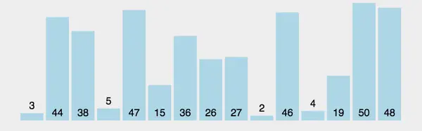
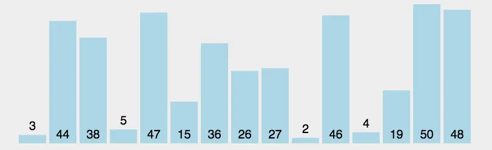

# 冒泡排序

## 算法原理

> 1. 第一次遍历从第一个元素到最后一个元素，两两比较大小，那么就会将最大的排序到最后面
>
> 2. 第二次遍历从第一个元素到倒数第二个元素，两两比较大小，那么就会将第二大的排序到倒数第二个位置
>
> 以此类推
>
> ......
>
> ......
>
> 就可以得到一个排序好的序列

可以参考https://zhuanlan.zhihu.com/p/42586566中的算法图

> 稳定排序：遇到数值相同的元素，排序前后的相对位置会不会保持不变

冒泡排序是稳定排序，冒泡排序适用于小数据的排序，不适用于数据量大的时候。

对冒泡排序进行<mark>优化</mark>：可以增加一个swap变量，当前一轮没有进行交换的时候，说明数组已经有序了，就不用再进行下一轮的循环了，直接退出。

## 时间空间复杂度

### 时间复杂度

| 情况         | 原因                                                         | 时间复杂度 |
| ------------ | ------------------------------------------------------------ | ---------- |
| 最坏（逆序） | 每对元素都要比较和交换                                       | O(n²)      |
| 平均         | 数据随机分布，比较次数还是约n² /2                            | O(n²)      |
| 最好（有序） | 加了 `swapped` 标志位，一轮内无交换即可提前终止循环，虽然序列有序但是也得遍历一次才知道是否有序，所以时间复杂度是O(n) | O(n)       |

### 空间复杂度

冒泡排序是原地排序算法，没有用到额外的数组、堆或者递归栈，所以空间复杂度是O(1)

# 选择排序

## 算法原理

> 1. 选择序列中最小的元素放在第一个
> 2. 从剩下的序列中选择最小的元素放在第二个
>
> 以此类推
>
> ......
>
> ......
>
> 就可以得到一个排序好的序列

